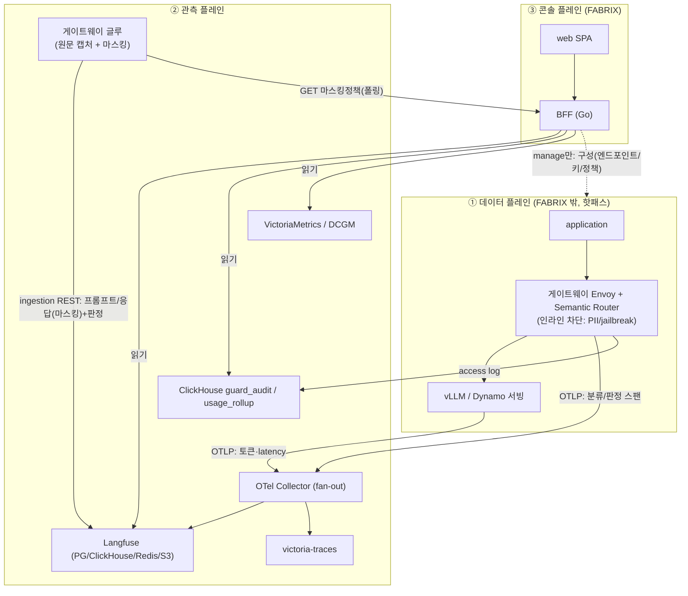

# FABRIX 아키텍처 — 2 프로파일 (observe / manage)

> 동일 코드베이스를 환경변수로 두 제품처럼 배포한다.
> - **observe** — 메트릭·trace·쿠버 데이터를 **읽기 전용** 관제로 보여줌(예: 삼성생명/삼성증권). → **[../observe/](../observe/)** (읽기 가이드+아키텍처+운영)
> - **manage** — 엔드포인트 생성·삭제까지 **완전 관리**(풀버전). → **[../manage/](../manage/)**
>
> 이 문서(architecture/README)는 **양쪽 공통 골격**만 다룬다. 환경별로 무엇을 읽을지는 위 디렉토리의 README 가 안내한다.
>
> 본 문서는 두 버전의 **공통 골격**과 **분기점**을 정의한다. 세부 통신 명세는 [../integration/](../integration/), 가드레일 전략은 [../research/langfuse-가드레일-전략-리서치.md](../research/langfuse-가드레일-전략-리서치.md).

## 핵심 원칙 (이번 설계의 결론)
1. **FABRIX(web+BFF)는 추론 트래픽을 중계하지 않는다.** 추론은 게이트웨이를 통과하고, FABRIX 는 그 텔레메트리를 **읽어 보여주거나(observe)** **플랫폼을 구성한다(manage)**. (플레이그라운드/평가의 테스트 호출만 예외)
2. **3-레이어 분리** — 차단(Semantic Router) / 증적(ClickHouse+WORM) / 관측(Langfuse). 합치지 않는다.
3. **관측은 OTEL** — SR·vLLM 스팬을 OTel Collector fan-out 으로 Langfuse 에. Python SDK 불필요(Go BFF 엔 Langfuse Go SDK도 없음).
4. **프롬프트/응답 원문은 게이트웨이 글루가 REST ingestion 으로** 별도 캡처(vLLM OTEL 은 토큰·latency만 보냄). **마스킹 정책으로 통제**.
5. **읽기/쓰기는 라우트 등록으로 게이팅** — observe 는 mutating 라우트 미등록(404/405). 차단은 UI 숨김이 아니라 백엔드가 담당.

## 용어 한 줄 정의
> 처음이면 여기부터 — 이후 문서의 용어가 막힘없이 읽힌다.

| 용어 | 정의 |
|---|---|
| **제논(Xenon)** | 모델 서빙·엔드포인트를 소유한 **호스트 플랫폼(고객 인프라)**. FABRIX 는 그 위/옆 Pod 로 배포돼 관측(observe)·관리(manage)한다. |
| **게이트웨이** | 추론 요청 관문(Envoy 등) — 인증·쿼터·가드레일·라우팅을 인라인 처리. 추론 핫패스의 중심. |
| **Semantic Router(SR)** | 게이트웨이의 인라인 분류·라우팅·**가드레일**(PII/jailbreak 차단) 컴포넌트. 보통 Envoy **ext_proc**(외부 처리 확장)로 붙는다. |
| **Dynamo** | NVIDIA Dynamo — vLLM 기반 분산 추론 서빙 프레임워크. 모델을 서빙. |
| **DynamoGraphDeployment** | Dynamo 모델 배포를 정의하는 쿠버 **CR**(= 엔드포인트 1개). manage 가 생성/삭제. |
| **vLLM** | LLM 추론 엔진. `/metrics`(Prometheus)·OTLP 트레이스(토큰·latency) 제공. |
| **OTEL / OTLP** | OpenTelemetry — 트레이스 표준. OTLP 는 그 전송 프로토콜(Langfuse 는 HTTP만, gRPC 불가). |
| **traceparent** | W3C 분산추적 헤더 — 같은 요청을 **한 trace 로 잇는 키**(SR·vLLM·글루가 공유해야 병합됨). |
| **게이트웨이 글루** | SR 옆 작은 서비스([`cmd/glue`](../../backend/cmd/glue/)) — 프롬프트/응답/판정을 **마스킹**해 Langfuse ingestion 으로 보냄(vLLM OTEL 이 원문을 안 보내므로). |
| **Langfuse** | LLM **관측·평가** 플랫폼(트레이스/세션). 런타임 가드레일이 **아니다**(차단은 SR). |
| **ClickHouse** | 컬럼형 DB — `guard_audit`(가드레일 증적)·`usage_rollup`(사용량 집계). |
| **WORM** | MinIO Object Lock 불변 보존 — 증적의 변경 불가 원본(규제 대응). |
| **victoria-traces** | OTLP 트레이스 저장소 — 서빙 내부 스팬(prefill/decode 등). |
| **VictoriaMetrics(vmselect)** | Prometheus 호환 메트릭 쿼리(트래픽·지연). **DCGM** = NVIDIA GPU 메트릭 exporter. |
| **Harbor** | OCI 레지스트리 — 모델 아티팩트 보관(임포트→서빙). |
| **capability / 프로파일** | 기능 플래그. `FABRIX_PROFILE`(observe/manage)가 기본 집합을, `FABRIX_FEATURES`(+/-)가 미세조정. 라우트 등록·NAV 의 단일 출처. |

## 3개 평면 (양쪽 공통)

| 평면 | 구성 | 소유 | FABRIX 역할 |
|---|---|---|---|
| **① 데이터 플레인** (추론) | app → 게이트웨이(Envoy+SR) → vLLM/Dynamo | 고객/제논 | observe: 관여 안 함 · manage: **구성**(엔드포인트·키·정책) |
| **② 관측 플레인** (텔레메트리) | OTel Collector, Langfuse, ClickHouse, victoria-traces, Prometheus/VM, DCGM, **게이트웨이 글루** | 고객/제논 + FABRIX(글루) | 적재된 데이터를 **읽음** |
| **③ 콘솔 플레인** | FABRIX **web**(SPA) + **BFF**(Go) | FABRIX | observe: 읽기 · manage: 읽기+쓰기 |

## 프로파일 분기 (평면별)

| | observe (읽기 전용) | manage (풀버전) |
|---|---|---|
| ① 데이터 플레인 | 관여 안 함(고객 운영) | **구성**: 엔드포인트 CR 생성/삭제, 키 발급, 정책·마스킹 편집 |
| ② 관측 플레인 | 읽기 | 읽기 + (정책/키 변경이 데이터플레인에 반영) |
| ③ 콘솔: 라우트 | mutating **미등록**(404/405) | 전부 등록 |
| ③ 콘솔: NAV | 관제·사용량·가드레일(읽기)·모델(읽기)·트레이스·세션·GPU·트래픽·연동상태 | 전체(+엔드포인트·키·플레이그라운드·평가·설정·자격증명) |
| 마스킹 정책 | 조회만(PUT 405) | **편집**(설정>가드레일>마스킹) |
| 전환 | `FABRIX_PROFILE=observe` | `FABRIX_PROFILE=manage`(기본) |
| 미세조정 | `FABRIX_FEATURES=+endpoints,+keys` 등 고객사별 | — |

> 분기의 단일 출처: [`backend/internal/capability`](../../backend/internal/capability/) → `GET /api/v1/capabilities`. 프론트가 받아 NAV·버튼 토글, 백엔드가 라우트 등록 결정.

## 배포 단위 (양쪽 공통, K8s Pod)
- **web** (nginx, 정적 SPA) + **BFF** (Go) — 2 Pod. env 로 프로파일 결정.
- (관측) **OTel Collector**, **Langfuse**(Helm), **ClickHouse/VM** — 고객 클러스터 또는 제논 제공. [k8s-otel-langfuse-연동.md](../integration/k8s-otel-langfuse-연동.md).
- (선택) **게이트웨이 글루** [`backend/cmd/glue`](../../backend/cmd/glue/) — 원문 캡처가 필요할 때.
- **진단**: 어느 배포든 `GET /api/v1/diagnostics`(능동 프로브)로 9개 의존성 실연동 상태 확인 — 연동 디버깅의 1차 도구.

## 다음 단계 (서버 준비 후)
1. **글루 ↔ 실 Langfuse 종단 확인** — `LANGFUSE_HOST/KEY` 채우고 `POST /v1/capture` → Langfuse 트레이스에 프롬프트/판정/응답 병합 확인(동일 W3C trace-id).
2. **게이트웨이 → `/v1/capture` 어댑터** — Envoy ext_proc / 사이드카 / 액세스로그 tailer 중 택1로 글루 호출.
3. **OTel Collector fan-out 구성** — SR/vLLM OTLP → Langfuse(otlphttp, HTTP만) + victoria-traces. 동일 traceparent 전파 확인.
4. **마스킹 정책 시드** — observe 단독 배포 시 manage 인스턴스가 없으면 글루는 기본 정책 사용 → 운영 정책을 PG 에 시드하거나 manage 로 1회 설정.
5. **로그 파이프라인** — gateway/vLLM access log → Fluent Bit/Vector → ClickHouse(usage_rollup/guard_audit).

## 이 세션 산출물 문서 맵
- 2-프로파일(환경별 읽기 가이드+아키텍처+운영): [../observe/](../observe/) · [../manage/](../manage/)
- 통신 명세: [../integration/README.md](../integration/README.md) (9개 의존성 + Langfuse API/MCP + K8s OTEL 연동)
- 가드레일 전략(교차검증): [../research/langfuse-가드레일-전략-리서치.md](../research/langfuse-가드레일-전략-리서치.md)
- 코드: `internal/capability`(프로파일) · `internal/diag`+`server/diagnostics.go`(진단) · `domain/masking.go`+`store/masking.go`+`server/masking.go`(마스킹) · `cmd/glue`(게이트웨이 글루)
