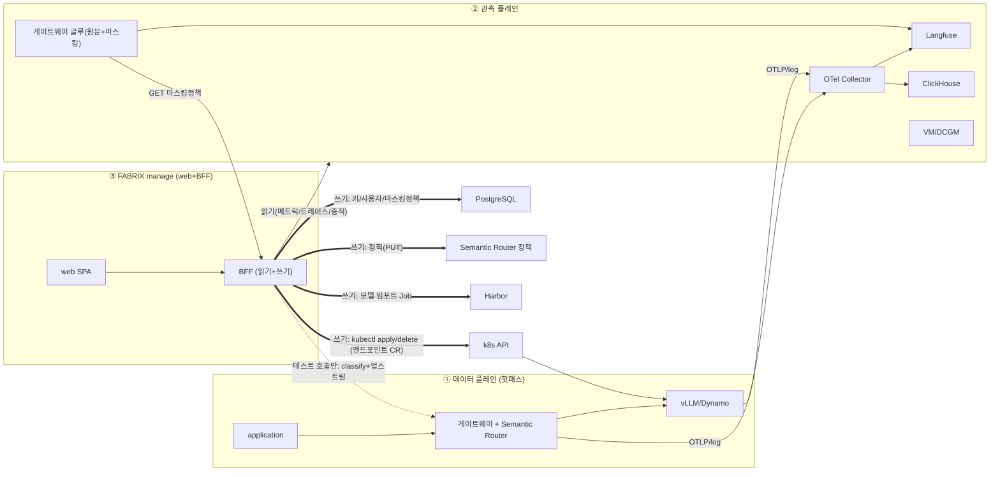

# manage 아키텍처 — 엔드포인트 완전 관리 (풀버전)

> `FABRIX_PROFILE=manage`(기본). observe 의 모든 읽기 + **플랫폼 구성(쓰기)**. 공통 골격: [../architecture/README.md](../architecture/README.md).

## 한눈에

## 설계 근거 (왜 이렇게)
- **왜 manage 도 핫패스에 안 끼나** — manage 가 추가로 하는 일은 **구성**(엔드포인트 배포·키·정책)이지 추론 처리가 아니다. 추론 1건은 게이트웨이가 담당. BFF 를 추론 프록시로 만들면 가용성·지연 문제가 생긴다(observe 와 동일 이유). → **컨트롤 플레인**으로만 동작.
- **왜 읽기/쓰기를 같은 코드에서 cap 으로 가르나** — observe 와 화면·로직이 동일하고 차이는 권한뿐. 포크 대신 capability 로 라우트 등록을 토글 → 한 번의 수정이 양쪽에 반영, 드리프트 없음.
- **왜 키 원문을 저장하지 않나(해시만)** — 유출 시 피해 최소화(R4). 발급 직후 1회만 평문 노출, 이후 sha256 해시+prefix 만 보관. 게이트웨이는 해시로 검증.
- **왜 FABRIX 생성 CR 만 삭제 가능한가** — 운영 리소스 보호. `fabrix.managed-by=fabrix-endpoint` 라벨이 붙은 DynamoGraphDeployment 만 삭제 허용 → 콘솔 오작동이 고객의 다른 워크로드를 지우지 못한다.
- **왜 마스킹 정책을 PG+폴링으로 글루에 전달하나** — 글루(데이터플레인)와 설정 UI(콘솔 BFF)는 **다른 프로세스**다. in-memory 정책은 글루에 닿지 않는다. PG 영속 + 글루 폴링이 프로세스 경계를 넘는 표준이고, 고객사가 "그때그때" 바꾸면 즉시 반영된다.

## 통신 명세 — 쓰기(manage 전용) + 읽기(observe 와 동일)
### 쓰기/구성 (manage 전용)
| # | 대상 | 용도 | 프로토콜 | 인증 | cap | 화면 |
|---|---|---|---|---|---|---|
| W1 | k8s API | **엔드포인트 배포/삭제**(DynamoGraphDeployment apply/delete, 라벨 가드) | kubectl/SA write | SA(create/delete) | endpoints.write | 엔드포인트 |
| W2 | PostgreSQL | **키 발급/회수**(해시·prefix만) | pgx | — | keys.write | 키·앱 |
| W3 | PostgreSQL | **사용자/역할/부서** CRUD | pgx | — | users.write | 설정(RBAC) |
| W4 | PostgreSQL | **마스킹 정책 편집**(글루 폴링) | pgx | — | guard.write | 가드레일>마스킹 |
| W5 | Semantic Router | **가드레일 정책 변경**(PUT)·분류 테스트 | HTTP | — | guard.write | 가드레일>정책 |
| W6 | k8s(Job)/Harbor | **모델 임포트**(HF→Harbor Job) | kubectl/HTTP | SA/Basic | models.write | 모델 임포트 |
| W7 | k8s Secret | **서드파티 자격증명**(HF/NGC 토큰) | kubectl | SA | credentials | 설정>자격증명 |
| W8 | SR+업스트림+ClickHouse | **플레이그라운드/평가**(테스트 호출 — BFF 가 추론 경로에 끼는 유일 예외) | HTTP | — | playground/eval | 플레이그라운드·평가 |

### 읽기 (observe 와 동일 9종)
메트릭(VM)·GPU(DCGM)·증적/사용량(ClickHouse)·트레이스/세션(Langfuse+victoria-traces)·엔드포인트/Pod/로그(k8s read)·모델(Harbor). → [../observe/아키텍처.md](../observe/아키텍처.md) 통신표.

## 등록 라우트
observe 의 모든 GET + **mutating 전부**: `POST/DELETE /endpoints*`, `POST/DELETE /keys*`, `PUT /guard/policy`, `PUT /masking/policy`, `POST /guard/classify`, `POST /harbor/import`, `POST/PUT/DELETE /users*`, `PUT /apps/{id}/dept`, `GET/PUT /credentials`, `POST /playground/chat`, `POST /eval/run`.

## NAV (web) — 전체
관제 · 사용량 · 가드레일(개요/증적/**정책·마스킹 편집**) · 모델(+임포트) · 플레이그라운드 · 평가 · 엔드포인트 · GPU · 키·앱 · 트래픽 · 트레이스 · 세션 · 설정(RBAC/+자격증명) · 연동 상태. 상단 배지 없음.

## 데이터 플레인 구성 흐름 (manage 의 본질)
- 엔드포인트 배포: 위저드 → preview(dry-run, `kubectl apply --dry-run=server`) → apply → vLLM Pod 기동 → 이후 트래픽이 게이트웨이→그 vLLM 으로.
- 키 발급: PG 해시 저장 → 게이트웨이가 인증·쿼터·귀속.
- 정책/마스킹 변경: SR 정책(차단) / 마스킹(PG, 글루 폴링) → 즉시 반영.

## 관측 플레인
observe 와 동일(OTEL→Langfuse, access log→ClickHouse, 글루 원문 캡처). manage 는 **마스킹 정책을 편집**(설정>가드레일>마스킹)해 글루 동작을 통제한다. 배포·검증: [배포-운영-검증.md](배포-운영-검증.md).
