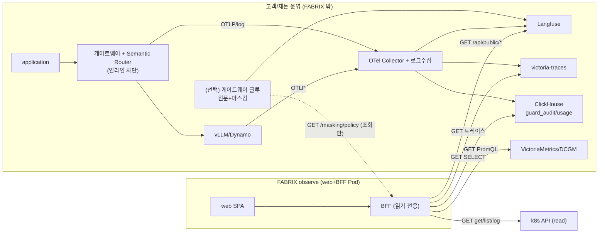

# observe 아키텍처 — 읽기 전용 관제 (삼성생명/삼성증권)

> `FABRIX_PROFILE=observe`. FABRIX 는 고객이 운영하는 추론 플랫폼의 **텔레메트리를 읽어 관제로만** 보여준다. 변경 없음(mutating 라우트 미등록 → 404/405). 공통 골격: [../architecture/README.md](../architecture/README.md).

## 한눈에

## 설계 근거 (왜 이렇게)
- **왜 FABRIX 가 추론 핫패스에 없나** — ① 가용성: 관제 콘솔 장애가 실서비스 추론을 막으면 안 된다. ② 지연: 모든 추론을 BFF 가 프록시하면 병목·SPOF. ③ 책임: 차단의 단일 출처(SSOT)는 게이트웨이의 Semantic Router다. → BFF 는 **텔레메트리 소비자**로 둔다.
- **왜 라우트 미등록(404) 으로 차단하나** — UI 숨김은 우회 가능(직접 호출). observe 는 `server.Handler` 에서 mutating cap 이 꺼져 **핸들러를 등록하지 않으므로** 404/405. "코드 레벨 불가"가 감사 증빙이 되고 공격 표면이 사라진다. (근거 코드: [`backend/internal/capability`](../../backend/internal/capability/), `server.Handler`)
- **왜 GET 만 노출하나** — observe 의 본질은 "관측". non-GET 이 하나도 없으면 "이 배포는 절대 상태를 바꾸지 못한다"가 구조적으로 보장된다. (분류 테스트 `POST /guard/classify` 조차 manage 로 옮긴 이유)
- **왜 미연동 소스에 graceful degrade 하나** — 고객사마다 보유 시스템이 다르다(Langfuse 없을 수도). 의존성 부재 시 그 화면만 빈 상태/비활성 → 전체가 죽지 않는다. 어떤 소스가 실제 연결됐는지는 능동 프로브로 답한다(아래).

## 통신 명세 (BFF 가 하는 것 — 전부 읽기)
| # | 대상 | 용도 | 프로토콜/포트 | 인증 | 방향 | 화면 |
|---|---|---|---|---|---|---|
| 1 | VictoriaMetrics/vmselect | 트래픽·지연 메트릭 | PromQL HTTP GET :8481 | (내부망) | BFF→ | 관제·트래픽 |
| 2 | DCGM/Prometheus | GPU/MIG | PromQL HTTP GET | (내부망) | BFF→ | GPU |
| 3 | ClickHouse `guard_audit` | 가드레일 증적 조회 | HTTP GET(SELECT) :8123 | X-ClickHouse creds | BFF→ | 가드레일 |
| 4 | ClickHouse `usage_rollup` | 사용량 귀속 조회 | HTTP GET(SELECT) :8123 | creds | BFF→ | 사용량 |
| 5 | Langfuse | 트레이스/세션 조회 | HTTP GET /api/public/* :3000 | Basic(pk/sk) | BFF→ | 트레이스·세션 |
| 6 | victoria-traces | 서빙 내부 스팬 | OTLP/HTTP query | (내부망) | BFF→ | 트레이스(병합) |
| 7 | k8s API | 엔드포인트·Pod·로그 조회 | kubectl/SA **read** | SA(RBAC get/list) | BFF→ | 모델·엔드포인트(목록) |
| 8 | Harbor | 모델 레지스트리 조회 | HTTP GET /api/v2.0 | Basic | BFF→ | 모델 |
| 9 | PostgreSQL | 마스킹 정책 **조회** | pgx | — | BFF→ | 가드레일>마스킹(읽기) |

> **왜 능동 프로브 진단(`GET /api/v1/diagnostics`)인가** — 설정값(URL 존재)만 보면 "값은 있는데 실제로 안 닿는" 케이스를 못 잡는다. 능동 프로브는 각 의존성에 실제 read-only 요청(SELECT 1·/healthz·kubectl 등)을 날려 **이 Pod 에서 실제 도달하는지·지연·에러**를 답한다 → 실사이트 연동 디버깅의 1차 도구. (코드: [`backend/internal/diag`](../../backend/internal/diag/))

## 라우트 — 등록 vs 미등록
**등록(전부 GET + 상태/진단):** `GET /healthz|/capabilities|/diagnostics`, dashboard cap(`/dashboard/*`,`/usage*`,`/gpu*`,`/proxy/*`), traces cap(`/traces*`,`/sessions*`), guard cap(`/guard/audit|status|policy(GET)|content`, **`/masking/policy(GET)`**), models cap(`/models*`,`/harbor/models|status`). 고객사 옵션(`FABRIX_FEATURES=+endpoints,+keys,+users`)으로 `GET /endpoints*`,`GET /keys`,`GET /org|users` 추가 가능.

**미등록(호출 시 404/405):** `POST/DELETE /endpoints*`, `POST/DELETE /keys*`, `PUT /guard/policy`, **`PUT /masking/policy`**, `POST /harbor/import`, `POST/PUT/DELETE /users*`, `/credentials*`, `POST /playground/chat`, `POST /eval/run`, `POST /guard/classify`.

## NAV (web)
관제 · 사용량 · 가드레일(개요/증적/**마스킹 읽기**) · 모델(목록) · 트레이스 · 세션 · GPU/MIG · 트래픽 · **연동 상태(diagnostics)**. 상단 **"관제 전용" 배지**. 그 외 메뉴는 숨김(딥링크도 관제로 폴백).

## 관측 플레인 — 누가 채우나 (FABRIX 아님, 고객/제논 운영)
- 메트릭/GPU: vLLM `/metrics`·DCGM → Prometheus/VM.
- 증적/사용량: 게이트웨이 access log + 가드레일 판정 → Fluent Bit/Vector → ClickHouse.
- 트레이스: SR(`routing.decision`/`classification`/security 스팬) + vLLM(토큰·latency) → OTel Collector → Langfuse.
- 프롬프트/응답 원문(선택): 게이트웨이 글루가 마스킹 후 ingestion. **왜 글루가 필요** — vLLM OTEL 은 토큰·latency만 보내고 **원문은 안 보낸다(공식)**. 원문은 게이트웨이(프롬프트·응답·판정을 모두 보는 choke point)에서 별도 캡처가 유일한 길이며, 마스킹을 POST 직전 한 곳에서 통제한다.

### ⚠️ 마스킹 정책 출처 (observe 단독 배포 시 함정)
observe 는 마스킹 정책을 **조회만** 한다(PUT 405). 정책을 **편집할 manage 인스턴스가 없으면** 글루는 ① 기본 정책(domain.DefaultMaskingPolicy) 사용 ② 운영자가 PG `masking_policy` 직접 시드 ③ manage 로 1회 설정 후 observe 가 읽음 — 셋 중 하나를 **배포 체크리스트에 명시**할 것.

## 배포 요약
web+BFF Pod, `FABRIX_PROFILE=observe`(+옵션 `FABRIX_FEATURES`). 읽기 소스 URL/creds 는 Secret. 관측 스택은 고객/제논 제공 → 인클러스터 ClusterIP 저지연. 상세·검증: [배포-운영-검증.md](배포-운영-검증.md).
