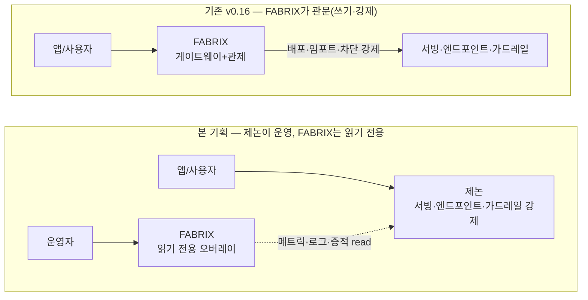
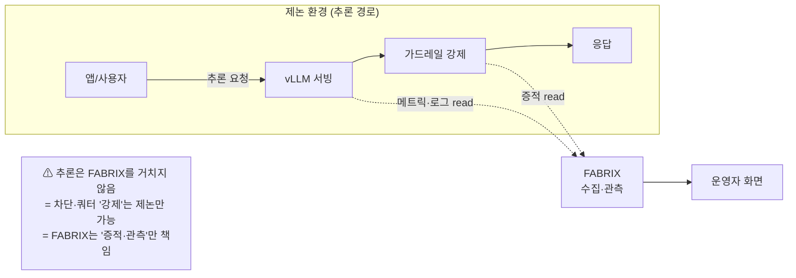
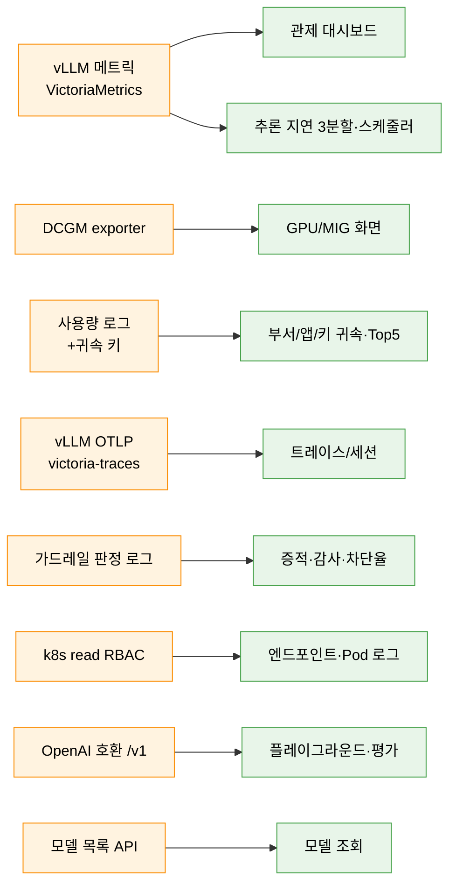
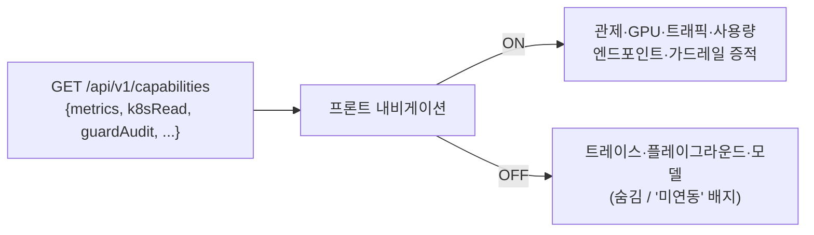

# FABRIX Endpoint — 기획서 (제논 연동 / 수집기 모델)

> **목적**: 제논(Xenon, https://www.genon.ai) 이 모델 서빙·엔드포인트 운영을 소유한 환경 위에서, FABRIX 가 **메트릭·쿠버네티스·가드레일 증적을 수집**하는 거버넌스·관측 오버레이로서 무엇을 하고, 그 실현을 위해 **제논에 무엇을 요청하며, 요청이 충족/불충족될 때 어떤 화면·기능이 가능/불가한지**를 기능별로 정리한다.
> **작성**: 메이머스트(MAYMUST) AI S/W Platform · 2026-06-24
> **짝 문서**: [02-아키텍처.md](02-아키텍처.md) · [03-일정.md](03-일정.md)
> **전제 결정(2026-06-24 확정)**: ① FABRIX 는 추론 경로 밖의 **읽기 전용 수집기** ② 제논 연동 인터페이스 **미정**(직접 접근/제논 API·export 양 시나리오 병기) ③ 모델·엔드포인트 **조회만** ④ **현 제논 클러스터에 Pod 형태로 배포** ⑤ **제논 서빙 엔진은 vLLM 기준**(NVIDIA Dynamo 아님 — Dynamo 는 자사 제품 단독 출시 시에만 채택) ⑥ 산출 문서 3종 분리.
---

## 1. 배경 — 역할 전환

기존 FABRIX(v0.16) 는 **추론의 단일 관문**으로서 직접 엔드포인트를 배포(k8s CR)하고 모델을 임포트(Harbor)하며 가드레일을 인라인 강제했다. 본 기획은 그 전제를 바꾼다.

| 구분 | 기존(v0.16) | 본 기획(제논 수집기) |
|---|---|---|
| 모델 서빙·엔드포인트 | FABRIX 가 직접 배포·운영 | **제논이 소유·운영** |
| 추론 트래픽 | FABRIX 단일 관문 경유 | **제논 환경 내부**(FABRIX 비경유) |
| 가드레일 | FABRIX 가 인라인 **강제** | 제논이 강제, FABRIX 는 **증적 수집·열람** |
| FABRIX 의 일 | 관문 + 관제 | **관측·증적 수집 오버레이(읽기 전용)** |
| 배포 | FABRIX 클러스터 | **제논 현 클러스터에 Pod 로 배포** |

→ FABRIX 는 "운영 주체"에서 **"제논 위에서 읽는 거버넌스·관측 층"** 으로 이동한다.

---

## 2. 제품 정의 — 무엇이고, 무엇이 아닌가

**FABRIX 는** 제논이 서빙하는 모델·엔드포인트의 **운영 현황(메트릭·GPU·Pod), 사용량, 가드레일 증적을 한 콘솔에서 관측·감사**하는 읽기 전용 거버넌스 도구다.

**FABRIX 는 (이 모델에서) 아닌 것**
- 추론을 중계·차단하는 게이트웨이가 **아니다** (강제는 제논 책임)
- 엔드포인트를 배포·삭제하는 오케스트레이터가 **아니다** (조회만)
- 모델을 레지스트리에 임포트하는 도구가 **아니다** (조회만)

> ⚠ 핵심 함의: **읽기 전용**이므로 "강제(enforcement)" 성격의 기능 — 가드레일 차단, 키 쿼터 하드캡, 트래픽 실측 — 은 *FABRIX 단독으로는 불가*하다. **그리고 모든 관측·증적 화면은 제논이 해당 데이터(특정 오픈소스의 메트릭/로그)를 노출해야만 그려진다. 노출하지 않으면 그 화면은 보여줄 수 없다**(§5 매트릭스).

---

## 3. 범위 (Scope)

**In scope**
- 제논 메트릭(트래픽·추론 품질·GPU) 수집 → 관제/사용량/GPU 화면
- 제논 k8s 엔드포인트·Pod 상태·로그 **조회**
- 제논 모델·엔드포인트 목록·상세 **조회**
- 가드레일 **증적 수집·열람·감사 export**(제논이 판정 데이터를 노출하는 경우)
- 사용량 귀속·집계(제논이 귀속 메타 또는 사용량 로그를 노출하는 경우)
- 분산 트레이스/세션 가시화(제논이 OTLP/trace 를 노출하는 경우)
- 플레이그라운드/평가(제논이 OpenAI 호환 추론 엔드포인트를 노출하는 경우)
- 비식별화, 커스텀 관제뷰(FABRIX 자체) — 증적 불변 보존(WORM)은 감사 요건 확인 시 옵션

**Out of scope (이 모델에서 제외)**
- 엔드포인트 생성·삭제·스케일 (제논 책임)
- 모델 임포트·레지스트리 쓰기 (제논 책임)
- 추론 인라인 차단·키 쿼터 하드캡 강제 (제논 책임 — FABRIX 는 위반 *증적*만)

---

## 4. 사용자 · 핵심 시나리오

| 사용자 | 시나리오 |
|---|---|
| 운영자/SRE | 제논 서빙 현황을 관제 대시보드로 글랜스 → 이상 시 GPU/Pod 로그/트레이스 드릴다운 |
| 보안/감사 | 가드레일 차단 증적을 기간·유형으로 조회, 불변 보존 사본으로 감사 대응·export |
| 플랫폼 관리 | 부서·앱·키별 사용량 추적, 비용 귀속 리포트 export |
| 개발자/검증 | 플레이그라운드로 모델 즉시 시험·멀티모델 비교·LLM-as-judge 평가 |

---

## 5. ★ 기능별 제논 요청 매트릭스 (본 문서의 핵심)

> **읽는 법**: 기능군마다 **① 제논에 요청할 구체 의존(오픈소스/메트릭/권한) → ② 노출 시 보여줄 화면 → ③ 노출 안 하면 못 보여주는 것(구체적으로)**. 연동 방식(직접 접근 vs 제논 API/export)은 미정이므로 *데이터/지표 단위*로 기술한다.
> **메트릭 라벨·로그 필드 수집 규격은 [02-아키텍처 §3.1](02-아키텍처.md) 에 정의**한다 — *메트릭에 어떤 라벨이, 로그에 어떤 식별 필드가 붙어 적재되어야 그 차원으로 분해해 보여줄 수 있는지*. 라벨/필드가 없으면 해당 화면을 분해해 보여줄 수 없다.

### 5.0 제논 의존 → 화면 한눈에 매핑

**(왼쪽 데이터가 노출돼야 오른쪽 화면이 켜진다)**

> 주황(제논이 노출해야 할 의존) → 초록(켜지는 화면). **주황이 없으면 연결된 초록 화면은 비활성/폴백**(각 §5.x "노출 안 하면 못 보여줌").

---

### 5.1 관제 대시보드 & 시각화

**제논에 요청(구체)** — Prometheus 호환 메트릭(VictoriaMetrics vmselect PromQL): **vLLM `/metrics` 시리즈**(`vllm:request_success_total`·`vllm:num_requests_running`·`vllm:time_to_first_token_seconds`·`vllm:gpu_cache_usage_perc` 등 — QPS·동시처리·성공률·TTFT·KV캐시). 또는 동등 메트릭 export.

**필수 라벨** — `model_name`·`namespace`·`pod`(스크레이프 타깃 라벨). 없으면 모델·엔드포인트별 분해 불가 → 전체 합산만. (규격 [§3.1(1)](02-아키텍처.md))

**노출 시 화면** — 관제 카드(트래픽·품질·가드레일·GPU 요약) + 시계열, 커스텀 관제뷰 빌더(패널 토글·FABRIX 자체).

**노출 안 하면 못 보여줌** — 제논이 **Prometheus/VictoriaMetrics 메트릭을 노출하지 않으면** 관제 대시보드의 실데이터 카드·시계열을 보여줄 수 없다(mock 표본 또는 "메트릭 미연동" 빈 상태). → 대체: 제논 콘솔 캡처/CSV 수기 적재(데모) 또는 제논 대시보드 링크아웃.

### 5.2 추론 성능 & 사용량 분석

**제논에 요청(구체)**

- ① **vLLM 지연 히스토그램** — `vllm:time_to_first_token_seconds`(TTFT) · `vllm:time_per_output_token_seconds`(TPOT) · `vllm:e2e_request_latency_seconds`(E2E) 각 p50/p95/p99, 생성속도(`vllm:generation_tokens_total`→tok/s), 스케줄러(`vllm:num_requests_running`/`_waiting`·KV `vllm:gpu_cache_usage_perc`)
- ② **사용량 로그/롤업**(요청·토큰·모델·시각) + **귀속 메타**(앱 / 부서 / API키ID / 세션ID)
- ③ **사내 디렉터리 매핑**(세션ID → 직원)

**필수 라벨/필드** — 메트릭 `model_name`; 사용량 로그에 `app_id`·`dept_id`·`api_key_id`·`session_id`·`prompt/completion_tokens`. 귀속 키가 없으면 모델 총량만. (규격 [§3.1(1),(3)](02-아키텍처.md))

**노출 시 화면** — 추론 지연 3분할 · 엔진 스케줄러 · 토큰 분해, 부서/앱/키/모델 4축 귀속, Top5 랭킹, 추세+forecast, CSV export.

**노출 안 하면 못 보여줌**

- **지연 히스토그램 메트릭이 없으면** → TTFT/TPOT/E2E 3분할·스케줄러 화면 불가
- **요청별 귀속 메타가 없으면** → 부서/앱/키/사용자별 사용량 불가, **모델 단위 총량만** 가능
- → 대체: 모델 총량 우선 인도 + 세션ID→직원 매핑(사내 디렉터리 연동) 후속

### 5.3 GPU · 트래픽 인프라 관제

**제논에 요청(구체)**

- ① **DCGM exporter** 메트릭(util·mem·temp·power·SM/Tensor) + 노드/GPU 인벤토리(노드명·GPU UUID·MIG 파티션 여부)
- ② **엔진 단계 메트릭**(차단율·업스트림 지연·큐 대기)
- ③ **요청 트레이스** — vLLM OpenTelemetry(OTLP) 스팬(요청 라이프사이클: 큐→prefill→decode) 또는 trace export(victoria-traces 수집)
  - *Dynamo 미사용이므로 gateway→router→engine 다단 스팬이 아닌 vLLM 단일 엔진 요청 스팬 기준*

**필수 라벨/필드** — DCGM `gpu`·`UUID`·`Hostname`; k8s 매핑 `exported_pod`·`exported_namespace`(없으면 엔드포인트↔GPU 귀속·유휴 갭 불가); MIG `GPU_I_ID`·`GPU_I_PROFILE`; 트레이스 `trace_id`·`session_id`. (규격 [§3.1(2),(5)](02-아키텍처.md))

**노출 시 화면** — GPU/MIG 3단 드릴다운(노드 LED→GPU 테이블→per-GPU 시계열) + 유휴 갭 KPI, 트래픽(엔진 파이프라인 분해), **트레이스/세션 화면**(스팬 트리·세션 타임라인).

**노출 안 하면 못 보여줌**

- **DCGM exporter 메트릭이 없으면** → GPU/MIG 화면 불가(비활성)
- **MIG 미파티션**이면 → 슬라이스 효율은 사실대로 "미분할" 표시
- **OTLP/victoria-traces 를 노출하지 않으면** → 개별 요청 분산 트레이스·세션 가시화 불가, 트래픽은 메트릭 집계만 가능. → 대체: 제논 트레이스 대시보드 링크아웃

### 5.4 가드레일 거버넌스 & 증적

**제논에 요청(구체)** — 택1 이상

- ① 추론을 분류기(Semantic Router 등) 경유시키고 **판정 로그를 FABRIX 분석DB(ClickHouse)에 적재 허용**
- ② 또는 제논 자체 가드레일의 **판정 데이터 export/스트림**(요청ID·판정 allowed/blocked/flagged·유형 PII/jailbreak·정책버전·HTTP status·지연·마스킹 샘플)
- ③ **(옵션·감사 불변 보존 요건 확인 시)** Object Lock(WORM) 스토리지(MinIO/ObjectScale) 또는 제논 자체 불변 보존

**필수 필드** — 판정 로그에 `request_id`·`verdict`·`type`·`policy_version`·`http_status`·`latency_ms`·`masked_sample`·`user_ref`(솔트 해시). 없으면 해당 컬럼/필터를 보여줄 수 없다. (규격 [§3.1(4)](02-아키텍처.md))

**노출 시 화면** — 가드레일 개요 · 증적 뷰(필터·상세 모달·status/latency 컬럼) · 감사 export. (WORM 불변 보존 배지는 옵션·요건 시)

**노출 안 하면 못 보여줌** — 제논이 **가드레일 판정 데이터를 노출하지 않으면** 운영 증적 화면 전체를 보여줄 수 없다(차단율·증적·정책 미러 불가). 이때 남는 것은 FABRIX 내장 **분류 테스트 도구**(임의 텍스트 즉시 판정) 데모뿐이며 "운영 증적은 제논 연동 후" 명시. (증적 저장은 기본 ClickHouse 조회로 충분하며, **감사 불변 보존 요건이 있을 때만** Object Lock(WORM)을 추가한다.)

> ⚠ **정책 편집 탭** — 강제 주체가 제논이므로 제거하거나 **제논 정책의 읽기 미러**로 변경(증적 중심으로 대응).

### 5.5 키 · 앱 & 예산 통제

**제논에 요청(구체)** — (키 *강제*가 필요하면) 제논 게이트웨이가 **FABRIX 발급 키(`x-api-key-id`)를 인식·검증·쿼터 적용**하도록 연동.

**노출 시 화면** — 키 발급/폐기 · 쿼터(rpm/tpd) · 예산 게이지 · 하드캡, 키별 사용량(귀속 메타 연동 시).

**노출 안 하면 못 보여줌** (읽기 전용 기본값) — 키 발급·조직 귀속은 FABRIX 자체 DB로 정상이나, 제논이 **키를 인식하지 않으면 쿼터 하드캡(429) 강제를 할 수 없다** → 예산은 "경고·게이지 표시"로 다운그레이드. 키별 사용량은 §5.2 귀속 메타에 종속.

### 5.6 플랫폼 기반 & 배포

**제논에 요청(구체)**

- ① **현 제논 클러스터에 FABRIX(web+backend) Pod 배포** — 네임스페이스 · 이미지(레지스트리/미러) · **read-only RBAC**(get/list/watch: pods·deploy·CR·pods/log)
- ② **k8s API read 권한**(엔드포인트·Pod 조회)
- ③ **사내 디렉터리(LDAP/AD) 연동** — 사용자 귀속
- ④ **폐쇄망/온프렘 전제** — 외부 의존(HF 등) 미러

**노출 시 화면** — 엔드포인트 목록(상태/replica/귀속) · Pod 실시간 로그, 사용자 RBAC · 부서 매핑, 조직 귀속 트리.

**노출 안 하면 못 보여줌**

- **k8s read RBAC 미제공** → 엔드포인트·Pod 상태·로그 불가("조회 권한 없음")
- **Pod 배포(네임스페이스/이미지) 불허** → 인클러스터 저지연 수집 불가, 외부 연동으로 폴백(아키텍처 §8)
- **사내 디렉터리 없음** → 사용자 단위 귀속 불가

### 5.7 모델 수명주기 & 검증

**제논에 요청(구체)**

- ① 제논 **모델 목록 API**(모델명·태그·크기·서빙 패턴) 또는 레지스트리 read, 엔드포인트↔모델 매핑
- ② **OpenAI 호환 추론 엔드포인트**(`/v1/chat/completions`·`/v1/models`) 접근 + (선택) 테스트용 키

**노출 시 화면** — 모델 목록/상세(운영 메트릭 카드), 플레이그라운드 채팅·멀티모델 비교·코드 보기, 평가(LLM-as-judge).

**노출 안 하면 못 보여줌**

- **모델 목록 API/레지스트리 read 없음** → 모델·엔드포인트 조회 화면 불가(소수 모델 수기 등재로 데모만)
- **`/v1` 추론 접근 없음** → 플레이그라운드·멀티모델 비교·평가 불가(본질적 의존) → 제논 콘솔 플레이그라운드로 위임

> 배포·임포트는 범위 제외(§3). 모델 임포트·HF/NGC 자격증명 화면은 제거/보류.

---

## 6. 화면 노출 범위 & 프론트 옵션 (capability gating)

### 6.1 제품 범위 — 제논 read 권한으로 "보는" 것

제논이 모델 서빙·엔드포인트·가드레일을 **운영·관리**하고, FABRIX 는 **read 권한으로 그 결과를 본다.** 따라서 본 제품이 그리는 화면은 아래 3가지를 *읽어서 보여줄 수 있는* 것에 한정된다.

1. **메트릭** (VictoriaMetrics/Prometheus)
2. **쿠버네티스 상태** (엔드포인트·Pod 조회)
3. **가드레일 결과** (판정 로그)

→ 프론트는 **이 데이터를 보여줄 수 있는 화면만** capability 옵션으로 노출하고, 나머지(읽기만으로 성립 안 되는 것 — 추론 호출이 필요한 플레이그라운드, 쓰기가 필요한 임포트 등)는 숨긴다. 제논이 추가 데이터를 read 로 열어주면 해당 화면 옵션도 켜진다(단계가 아니라 **데이터 가용성**에 따라 켜짐).

### 6.2 프론트 화면 노출 옵션 (capability flag)

- 백엔드가 `GET /api/v1/capabilities` 로 **현재 연동된 능력**을 manifest 로 반환한다(설정값 + 도달성 프로브 기반 — [02-아키텍처 §6.1](02-아키텍처.md)).
- 프론트는 로드 시 이를 읽어 **능력이 켜진 화면만 내비게이션에 노출**하고, 꺼진 화면은 **숨김**(또는 "미연동" 비활성 배지) 처리한다.
- 빌드/환경 변수로도 강제 가능(기존 `VITE_MOCK` 류 프론트 옵션과 동일 계열).

| capability 플래그 | 의미 | 기본(read 범위) |
|---|---|---|
| `metrics` | VictoriaMetrics 메트릭 | ✅ ON |
| `k8sRead` | k8s read 권한 | ✅ ON |
| `guardAudit` | 가드레일 결과 로그 | ✅ ON |
| `traces` | vLLM OTLP 트레이스 | ⬜ 데이터 노출 시 |
| `inference` | OpenAI 호환 `/v1` | ⬜ 데이터 노출 시 |
| `modelRegistry` | 모델 목록 API | ⬜ 데이터 노출 시 |
| `usageAttribution` | 귀속 키 포함 사용량 로그 | ⬜ 데이터 노출 시 |
| `directory` | 사내 디렉터리(LDAP/AD) | ⬜ 데이터 노출 시 |

### 6.3 화면 ↔ 노출 조건

> ✅기본 노출(read 범위) / 🔶데이터 노출 시 / ⛔범위제외 / (상시=FABRIX 자체)

| 화면 | 노출 조건(플래그) | 노출 | 비고 |
|---|---|---|---|
| 관제(Dashboard) | `metrics` | ✅ 기본 | — |
| GPU/MIG | `metrics`(DCGM) | ✅ 기본 | — |
| 트래픽(Traffic) | `metrics` | ✅ 기본 | 메트릭 기반 재구현 |
| 사용량(Usage) | `metrics` | ✅ 기본 | **모델 총량만**. 부서/앱/키 귀속은 `usageAttribution` 필요 |
| 엔드포인트(조회)·Pod 로그 | `k8sRead` | ✅ 기본 | 생성/삭제 ⛔ |
| 가드레일 증적 | `guardAudit` | ✅ 기본 | 정책 편집은 읽기 미러/제거 |
| 설정/사용자(RBAC) | 상시(FABRIX DB) | ✅ 기본 | — |
| 커스텀 관제뷰 빌더 | `metrics`(+FABRIX) | ✅ 기본 | 패널 토글 |
| 트레이스/세션 | `traces` | 🔶 조건부 | OTLP 노출 시 |
| 플레이그라운드 | `inference` | 🔶 조건부 | `/v1` 노출 시 |
| 평가(Eval) | `inference` | 🔶 조건부 | `/v1` 노출 시 |
| 모델(조회) | `modelRegistry` | 🔶 조건부 | 모델 목록 API 노출 시 |
| 사용량 귀속(부서/앱/키)·Top5 | `usageAttribution` | 🔶 조건부 | 귀속 키 로그 노출 시 |
| 키·앱(쿼터 강제) | 제논 키 인식 | 🔶 조건부 | 발급·귀속은 상시, 강제만 조건부 |
| 조직 사용자 단위 귀속 | `directory` | 🔶 조건부 | 사내 디렉터리 연동 시 |
| 모델 임포트 | — | ⛔ 제외 | 범위 제외 |
| 자격증명(HF/NGC) | — | ⛔ 제외 | 임포트 의존 — 제거/보류 |

---

## 7. 비기능 요구

- **읽기 전용·최소 권한**: 모든 제논 연동은 read 권한만. k8s 는 get/list/watch 한정, 쓰기/배포 권한 미요청.
- **비식별화**: 증적 사용자 식별자 솔트 해시, 프롬프트 원문/PII 미저장(마스킹 샘플만).
- **증적 불변성(옵션)**: 기본은 ClickHouse 조회. **감사 불변 보존 요건 확인 시** WORM 보존(예: 365일) 추가.
- **폴백·장애 격리**: 각 제논 의존이 없거나 죽어도 콘솔은 뜨고 해당 화면만 빈 상태/비활성(상세 [02-아키텍처 §6](02-아키텍처.md)).
- **폐쇄망**: 온프렘/폐쇄망 전제 — 외부 의존(HF 등)은 제논 내부 미러 사용.
- **보안 공유**: 내부 노드명·포트·네임스페이스는 외부 공유 시 비식별화.

---

## 8. 가정 · 제약 · 리스크

| 항목 | 내용 | 영향 |
|---|---|---|
| 연동 방식 미정 | 직접 접근 vs 제논 API/export 미확정 | 모든 🔶 화면의 구현 방식·일정이 여기 종속 → **Phase 0 협의가 critical path** |
| 강제 불가 | 읽기 전용이라 가드레일 차단·키 하드캡 강제 못함 | 거버넌스가 "사후 증적" 중심 — 고객 기대치 사전 조율 필요 |
| 증적 가용성 | 제논이 가드레일 판정을 노출 안 하면 §5.4 전체 미사용 | 가드레일 가치 제안의 핵심 리스크 |
| 귀속 메타 | 요청별 식별자 없으면 사용자별 추적 불가 | 고객 "사용자별 사용량 추적" 직접 영향 |
| 트레이스 노출 | OTLP 미노출 시 분산 트레이스(프록시/Pod 통신 가시화) 미사용 | 트래픽은 메트릭 집계만 |

---

## 9. 제논 요청서 요약 (체크리스트)

> 연동 설계 입력. 항목별 가능/불가가 §5 매트릭스의 화면 가용성을 결정한다.

1. **메트릭** — Prometheus 호환(VictoriaMetrics) 또는 트래픽·지연 메트릭 export (§5.1)
2. **지연 히스토그램** — vLLM `vllm:time_to_first_token_seconds` 등 TTFT/TPOT/E2E·스케줄러 (§5.2)
3. **사용량 + 귀속 메타** — 사용량 로그 + 앱/부서/키/세션 식별자 (§5.2)
4. **GPU** — DCGM exporter 메트릭 + 노드/GPU 인벤토리 (§5.3)
5. **분산 트레이스** — victoria-traces(OTLP) 또는 trace export (§5.3)
6. **k8s read** — 네임스페이스 get/list/watch(pods·deploy·CR·pods/log) (§5.6)
7. **Pod 배포** — 현 클러스터 네임스페이스·이미지(미러)·read RBAC (§5.6)
8. **가드레일 증적** — 판정 데이터 export/스트림 또는 분류 경유+적재 (§5.4)
9. **증적 저장** — ClickHouse 적재(기본). 불변 보존은 **감사 요건 시 옵션**(Object Lock/제논 보존) (§5.4)
10. **모델/엔드포인트 목록** — 조회 API 또는 레지스트리 read (§5.7)
11. **추론 엔드포인트** — OpenAI 호환 `/v1` 접근 + 모델 목록 (§5.7)
12. **사내 디렉터리** — 세션ID→직원 매핑(LDAP/AD) (§5.2·§5.6)
13. **(선택) 키 인식** — 제논 게이트웨이의 FABRIX 키 검증 연동 (§5.5)
14. **환경 정보** — 노드 구성·네임스페이스·접근 경로(연동 방식·배포 확정용)

---

## 10. 제논 측 준비·연동 점검 체크리스트 (제논 작성)

> 제논 엔지니어가 **답** 칸을 ☑(가능)/☒(불가)/❓(확인필요)로 채우면, 그 자리에서 **어떤 화면이 켜지고 꺼지는지** 판정된다. 우측 `flag` 는 프론트 capability(§6.2)와 1:1. "구체 확인" 은 제논 측에서 즉시 점검할 수 있는 방법.

### 10.1 메트릭 · GPU (→ `metrics`)

| 영역 | 점검 질문 | 구체 확인 | 답 | 예 → / 아니오 → |
|---|---|---|---|---|
| 메트릭 | vLLM `/metrics` 노출되나? | `curl http://<vllm-svc>:8000/metrics \| grep '^vllm:'` | ☐ | 예→관제·사용량(총량)·트래픽 / 아니오→빈 상태 |
| 메트릭 | Prometheus 호환 쿼리 엔드포인트(vmselect/Prometheus) URL·인증 제공? | 엔드포인트 URL + 토큰 전달 | ☐ | 예→메트릭 조회 경로 확보 / 아니오→수집 불가 |
| 메트릭 | 메트릭에 `model_name`·`pod`·`namespace` 라벨 유지? | 위 출력의 라벨 확인 | ☐ | 예→모델·엔드포인트 분해 / 아니오→전체 합산만 |
| GPU | dcgm-exporter 설치·노출? | `kubectl get pods -A \| grep dcgm` · `curl <dcgm>:9400/metrics` | ☐ | 예→GPU/MIG 화면 / 아니오→비활성 |
| GPU | k8s pod 매핑(`exported_pod`·`exported_namespace`) 라벨 on? | dcgm metrics 라벨 확인 | ☐ | 예→엔드포인트↔GPU 귀속·유휴 갭 / 아니오→GPU 단위까지만 |
| GPU | MIG 파티션 사용? 프로파일 라벨(`GPU_I_PROFILE`)? | DCGM/노드 확인 | ☐ | 예→슬라이스 효율 / 아니오→"미분할" 표시 |

### 10.2 쿠버네티스 read (→ `k8sRead`)

| 점검 질문 | 구체 확인 | 답 | 예 → / 아니오 → |
|---|---|---|---|
| FABRIX ServiceAccount 에 read-only RBAC 부여 가능?(get/list/watch: pods·deployments·CR·pods/log) | 적용할 Role/RoleBinding YAML 합의 | ☐ | 예→엔드포인트·Pod·로그 조회 / 아니오→"조회 권한 없음" |
| 대상 네임스페이스는? | 네임스페이스명 전달 | ☐ | — |
| (검증) 권한 확인 | `kubectl auth can-i list pods --as=system:serviceaccount:<ns>:<sa>` → yes? | ☐ | — |

### 10.3 가드레일 (→ `guardAudit`)

| 점검 질문 | 구체 확인 | 답 | 예 → / 아니오 → |
|---|---|---|---|
| 추론 경로에 가드레일/분류기가 있나? | 구성 확인 | ☐ | 아니오→증적 화면 자체 불가(분류 테스트 데모만) |
| 판정 로그 산출? 필드(`verdict`·`type`·`policy_version`·`http_status`·`latency`·`masked_sample`·`user_ref`)? | 로그 샘플 1건 | ☐ | 예→증적 컬럼·필터 표시 / 부족→해당 컬럼만 누락 |
| 판정 로그를 우리 분석DB(ClickHouse)로 적재 허용 OR export/스트림 제공? | 연동 방식 합의 | ☐ | 예→증적 수집·조회 경로 확보(기본) |
| **(옵션)** 증적을 변조 불가로 N년 보존해야 하는 감사·규제 요건이 있나? | 컴플라이언스 확인 | ☐ | 예→Object Lock(WORM)/제논 보존 추가 / 아니오→ClickHouse 조회로 충분 |

### 10.4 사용량 귀속 · 추론 · 트레이스 · 디렉터리

| 영역 | 점검 질문 | 구체 확인 | 답 | flag | 예 → / 아니오 → |
|---|---|---|---|---|---|
| 사용량 로그 | 요청 로그에 `app_id`·`dept_id`·`api_key_id`·`session_id` 포함? | 로그 샘플 | ☐ | `usageAttribution` | 예→부서/앱/키 귀속·Top5 / 아니오→모델 총량만 |
| 사용량 로그 | 로그 수집기(Fluent Bit/Vector) 운영·전달 가능? | 파이프라인 확인 | ☐ | `usageAttribution` | 예→적재 경로 확보 |
| 추론 | OpenAI 호환 `/v1` 접근(네트워크+키) 제공? | `curl http://<svc>/v1/models` | ☐ | `inference` | 예→플레이그라운드·평가 / 아니오→비활성 |
| 모델 | 모델 목록 API 또는 레지스트리 read? | API/레지스트리 | ☐ | `modelRegistry` | 예→모델 조회 화면 |
| 트레이스 | vLLM OTLP 트레이싱 활성? collector→victoria-traces? | 구성 확인 | ☐ | `traces` | 예→트레이스/세션 / 아니오→메트릭 집계만 |
| 디렉터리 | 사내 디렉터리(LDAP/AD) 세션ID→직원 매핑 가능? | 연동 방식 | ☐ | `directory` | 예→사용자 단위 귀속 |

### 10.5 배포 & 네트워크 (전제 — 막히면 위 전부 영향)

| 점검 질문 | 구체 확인 | 답 | 예 → / 아니오 → |
|---|---|---|---|
| 현 클러스터에 `fabrix` 네임스페이스 할당? | 네임스페이스 | ☐ | 예→인클러스터 배포 / 아니오→외부 연동 폴백 |
| 이미지 레지스트리/미러 push 가능?(폐쇄망) | 레지스트리 접근 | ☐ | 예→이미지 배포 가능 |
| 운영자 접근 Ingress/NodePort? | 접근 경로 | ☐ | 예→화면 접속 |
| PVC/스토리지(PostgreSQL·분석DB) 제공? | 스토리지클래스 | ☐ | 예→키·조직·증적 영속 |
| **FABRIX Pod 에서 위 엔드포인트 도달 가능?**(NetworkPolicy/방화벽) | Pod→각 엔드포인트 연결 테스트 | ☐ | 막히면 해당 수집 전부 불가 |

> **판정 규칙**: `metrics`·`k8sRead`·`guardAudit` 3개가 ☑ 면 핵심 화면(관제·GPU·트래픽·사용량 총량·엔드포인트·가드레일 증적)이 가동된다. 나머지 ☐ 는 켜지는 만큼 화면이 추가된다(§6.3).

---
*본 문서는 협의 진행에 따라 갱신된다. 짝 문서: [02-아키텍처.md](02-아키텍처.md) · [03-일정.md](03-일정.md)*
