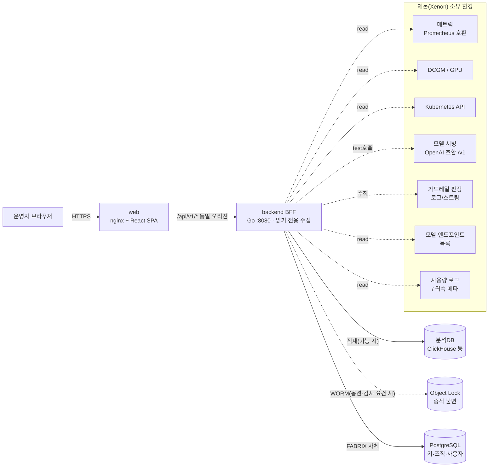
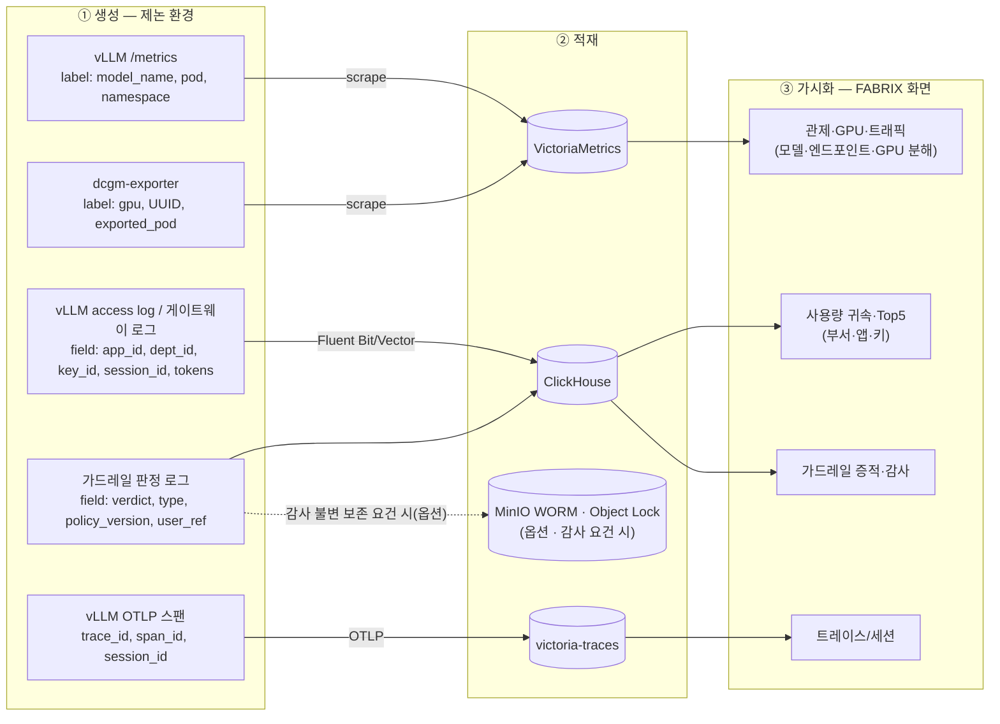
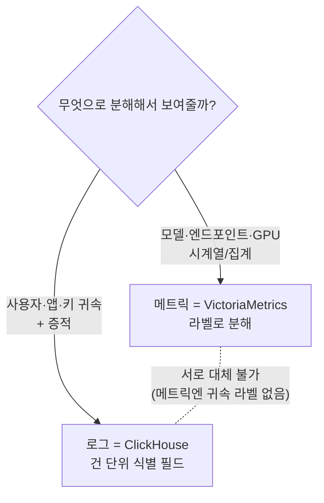
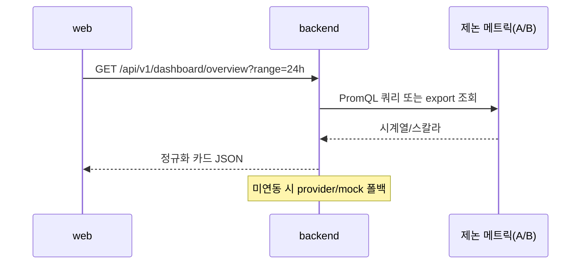
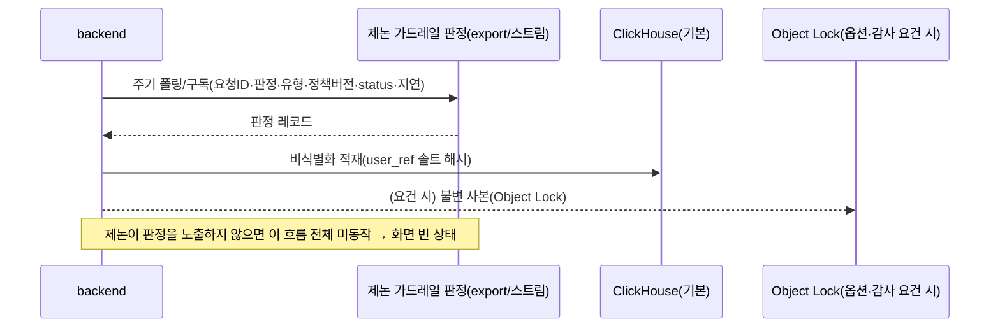
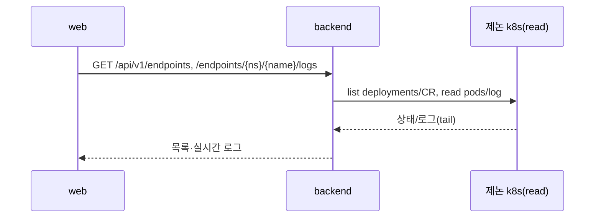
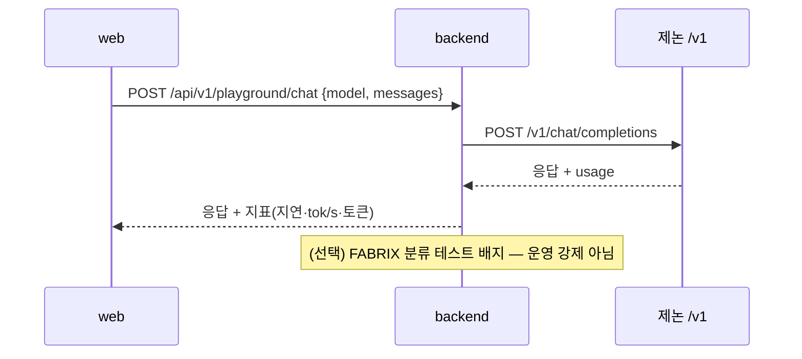
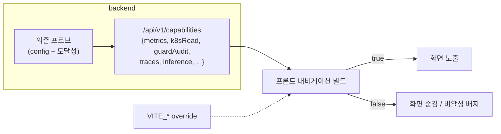
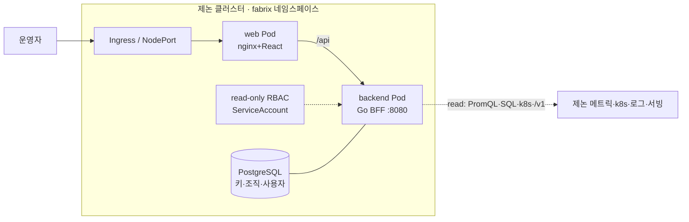

# FABRIX Endpoint — 아키텍처 (제논 연동 / 수집기 모델)

> **목적**: 제논이 모델 서빙·엔드포인트를 소유한 환경에서, FABRIX 가 **읽기 전용으로** 메트릭·k8s·가드레일 증적을 수집하기 위한 구성·통신·데이터 흐름·폴백·보안을 정의한다.
> **작성**: 메이머스트(MAYMUST) · 2026-06-24 · 짝 문서 [01-기획서.md](01-기획서.md) · [03-일정.md](03-일정.md)
> **전제**: ① 읽기 전용 수집기 ② 연동 인터페이스 미정(직접 접근 / 제논 API·export 양 시나리오 병기) ③ 모델·엔드포인트 조회만.

> **[2026-06 갱신] 2-프로파일로 확장됨.** 본 문서의 "읽기 전용 수집기"는 이제 **observe 프로파일**에 해당하고, 엔드포인트까지 관리하는 **manage 프로파일**이 추가됐다(동일 코드베이스, `FABRIX_PROFILE`). 또한 트레이스 관측은 **OTEL→Langfuse**, 프롬프트/응답 원문은 **게이트웨이 글루+마스킹 정책**으로 확정됐다. 최신·완결 아키텍처는 아래 문서를 단일 출처로 본다:
> - 개요·공통 골격: [../architecture/README.md](../architecture/README.md)
> - 읽기 전용(삼성): [../observe/](../observe/) (README→아키텍처→배포·운영·검증)
> - 엔드포인트 관리: [../manage/](../manage/)
> 본 문서(§ 이하)는 데이터 소스·필드·폴백의 상세 근거로 계속 유효하다.

---

## 1. 개요 — 구조

FABRIX 는 **2-tier + BFF** 구조를 유지하되, 백엔드(BFF)가 *추론 관문*에서 **제논 데이터 수집·집계 층**으로 역할이 바뀐다.

- **web** — React + Vite 정적 SPA(nginx). 운영자 화면.
- **backend(BFF, Go)** — 화면이 필요로 하는 데이터를 제논의 여러 소스에서 **읽어** 집계·정규화. 추론 트래픽을 중계하지 않는다(플레이그라운드/평가의 *테스트 호출* 예외).

---

## 2. 한눈에 보는 아키텍처



핵심 원칙(유지): **모든 제논 의존은 선택적**. 특정 소스가 없거나 막히면 백엔드는 뜨고 그 화면만 빈 상태/비활성으로 폴백한다(§6).

---

## 3. 연동 인터페이스 — 두 시나리오 (미정)

연동 방식이 미정이므로, 항목마다 **(A) 하부 인프라 직접 접근**과 **(B) 제논 자체 API/export** 두 경로를 병기한다. 협의로 항목별 확정.

| # | 데이터 | (A) 직접 접근 | (B) 제논 API/export | 미연동 시 폴백 |
|---|---|---|---|---|
| 1 | 트래픽·추론 지연 메트릭 | PromQL HTTP (vmselect 등) | 메트릭 REST/CSV export | mock/빈 상태 |
| 2 | GPU/MIG | DCGM PromQL + 노드 인벤토리 | GPU 상태 API/export | GPU 화면 비활성 |
| 3 | 엔드포인트·Pod·로그 | k8s API read(get/list/watch, pods/log) | 상태·로그 조회 API | "조회 권한 없음" |
| 4 | 가드레일 증적 | 분류 경유 + 분석DB 적재 | 판정 export/스트림 | 분류 테스트 도구만 |
| 5 | 증적 불변 보존 (옵션·감사 요건 시) | Object Lock 스토어 직접 | 제논 자체 보존 사용 | ClickHouse 조회만(보존 생략) |
| 6 | 모델·엔드포인트 목록 | 레지스트리/k8s CR read | 모델 목록 API | 카탈로그 수기 등재 |
| 7 | 추론(테스트) | OpenAI 호환 `/v1` 직접 | 제논 추론 프록시 API | 플레이그라운드 비활성 |
| 8 | 사용량 귀속 | 사용량 로그 직접 read | 사용량 export + 메타 | 모델 총량만 |
| 9 | 분산 트레이스 | victoria-traces(OTLP) 직접 | trace export API | 트레이스/세션 화면 비활성 |
| 10 | 사용자 귀속 | 사내 디렉터리(LDAP/AD) 조회 | 직원 매핑 export | 사용자 단위 귀속 불가 |

> **결정 필요**: 항목별로 A/B 중 무엇으로 확정할지는 제논 협의 결과에 종속(→ [03-일정 Phase 0](03-일정.md)). 본 문서는 확정 시 표를 갱신한다.

---

### 3.1 메트릭·로그 수집 규격 — 생성 → 적재 → 필수 라벨 → 가시화 (★핵심)

> 읽기 전용 수집기에서 **"무엇을 보여줄 수 있는가"는 메트릭/로그에 어떤 라벨·필드가 붙어 적재되는가로 결정**된다. 라벨이 없으면 그 차원으로 분해(break-down)할 수 없다. 아래는 제논에 **"이 라벨/필드를 붙여 노출해 달라"** 고 요청해야 하는 규격이다.



> 읽는 법: **왼쪽(생성 시 어떤 라벨/필드가 붙는가)** 이 비면 **오른쪽 화면의 분해 축**이 사라진다. 예) `exported_pod` 없으면 s1 의 "엔드포인트↔GPU", `dept_id` 없으면 s2 의 "부서별".

#### (1) vLLM 추론 메트릭
| 항목 | 내용 |
|---|---|
| 생성 위치 | 각 **vLLM 서빙 Pod** 의 `/metrics`(Prometheus 텍스트) |
| 적재 경로 | `VMServiceScrape`/`ServiceMonitor` 로 스크레이프 → **VictoriaMetrics** → FABRIX 가 PromQL 조회 |
| **필수 라벨** | `model_name`(모델 분해) · 스크레이프 타깃 라벨 `namespace`·`pod`·`service`(엔드포인트 분해) · (신버전) `engine` |
| 이 라벨로 보여줌 | 모델별 QPS·TTFT·TPOT·tok/s, **엔드포인트(Pod)별** 분해, 스케줄러(running/waiting)·KV캐시 |
| 라벨 없으면 **못 보여줌** | `model_name` 미부착 → 모델별 분해 불가(전체 합산만). 스크레이프가 `pod`/`namespace` 를 drop → 엔드포인트별 분해 불가 |
| ⚠ 주의 | vLLM `/metrics` 는 **app/dept/key/session 라벨을 갖지 않는다**(고카디널리티). → 사용자·앱·키 **귀속은 메트릭이 아니라 (3) 요청 로그**에서만 나온다 |

#### (2) GPU 메트릭 (DCGM exporter)
| 항목 | 내용 |
|---|---|
| 생성 위치 | 각 GPU 노드 **dcgm-exporter** `/metrics`(`DCGM_FI_DEV_GPU_UTIL`·`_FB_USED/FREE`·`_POWER_USAGE`·`_GPU_TEMP`·`PROF_SM_ACTIVE`·`PROF_PIPE_TENSOR_ACTIVE`) |
| 적재 경로 | `VMServiceScrape` → VictoriaMetrics |
| **필수 라벨** | `gpu`·`UUID`·`Hostname`·`modelName`(GPU 모델) · **k8s 매핑 활성화 시** `exported_pod`·`exported_namespace`·`exported_container` · MIG 시 `GPU_I_ID`·`GPU_I_PROFILE` |
| 이 라벨로 보여줌 | GPU별 util/mem/temp/power, 노드별 요약, **(k8s 매핑 시) 엔드포인트↔GPU 귀속 → 유휴 할당 갭 KPI**, MIG 슬라이스 효율 |
| 라벨 없으면 **못 보여줌** | `exported_pod` 매핑 미설정 → "어느 엔드포인트가 어느 GPU 점유"를 못 보여줌 → 유휴 갭 불가. MIG 라벨 없으면 슬라이스 효율 불가(미분할은 사실대로 표시) |

#### (3) 추론 요청/사용량 로그 — 귀속의 유일한 원천
| 항목 | 내용 |
|---|---|
| 생성 위치 | **vLLM access log** 또는 제논 게이트웨이/프록시 로그(요청 1건=1레코드) |
| 적재 경로 | 로그 수집(Fluent Bit/Vector 등) → **ClickHouse `usage_rollup`** |
| **필수 필드** | `timestamp`·`model`·`prompt_tokens`·`completion_tokens`·`latency_ms` + **귀속 키** `app_id`·`dept_id`·`api_key_id`·`session_id` |
| 이 필드로 보여줌 | 부서/앱/키/모델 **4축 귀속**, Top5 랭킹, 추세+forecast, 키별 사용량·비용 추정 |
| 필드 없으면 **못 보여줌** | 귀속 키(app/dept/key/session) 미부착 → 사용자·앱·키별 추적 불가, **모델 단위 총량만** |

#### (4) 가드레일 판정 로그
| 항목 | 내용 |
|---|---|
| 생성 위치 | 분류기(Semantic Router 등) 또는 제논 자체 가드레일 |
| 적재 경로 | **기본**: → **ClickHouse `guard_audit`**(조회·집계). **옵션**(감사 불변 보존 요건 확인 시): + MinIO WORM(Object Lock) 또는 제논 자체 불변 보존 사용 |
| **필수 필드** | `request_id`·`verdict`(allowed/blocked/flagged)·`type`(PII/jailbreak)·`policy_version`·`http_status`(403/200)·`latency_ms`·`masked_sample`·`user_ref`(솔트 해시) |
| 이 필드로 보여줌 | 증적 뷰(필터·상세)·차단율·정책 읽기 미러·감사 export (WORM 보존 배지는 요건 시) |
| 필드 없으면 **못 보여줌** | 판정 로그 미노출 → 증적 화면 전체 불가(분류 테스트 데모만). `user_ref` 없으면 주체별 증적 추적 불가 |

#### (5) 분산 트레이스
| 항목 | 내용 |
|---|---|
| 생성 위치 | **vLLM OpenTelemetry exporter**(요청 단위 스팬) |
| 적재 경로 | OTLP → collector → **victoria-traces** |
| **필수 필드** | `trace_id`·`span_id`·단계 스팬(queue→prefill→decode)·`model_name`·(가능 시) `session_id`(세션 연결) |
| 이 필드로 보여줌 | 요청 트레이스 스팬 트리, 세션 타임라인 |
| 필드 없으면 **못 보여줌** | OTLP 미노출 → 트레이스/세션 화면 불가. `session_id` 없으면 세션 묶음 불가(요청 단위만) |

> **요약 원칙**: ① **메트릭(VictoriaMetrics)** = 모델·엔드포인트·GPU 차원(라벨로 분해) — *집계/시계열*. ② **로그(ClickHouse)** = 사용자·앱·키 귀속과 증적 — *건 단위 식별자*. 둘은 서로 대체 불가하며, 제논에 **메트릭은 라벨을, 로그는 식별 필드를** 각각 요청해야 한다.



---

### 3.2 분야별 조회 로직 예시 (FABRIX → 제논)

> 실제 FABRIX 백엔드가 각 화면을 그리려고 던지는 쿼리/호출이다. 제논은 이 호출이 **어떤 엔드포인트에·어떤 부하로·무슨 권한으로** 들어오는지 가늠할 수 있다.
> ⚠ 메트릭명은 **vLLM 네이티브 기준**으로 표기했다(현 FABRIX 코드는 `dynamo_frontend_*` 계열 — Phase 1 어댑터에서 `vllm:*` 로 매핑).

**① 관제 · 트래픽 · 품질 — PromQL → VictoriaMetrics**
```promql
# 트래픽: QPS / 동시처리 / 대기
sum(rate(vllm:request_success_total[2m]))
sum(vllm:num_requests_running)
sum(vllm:num_requests_waiting)

# 품질: TTFT/TPOT/E2E 분위수(히스토그램)
histogram_quantile(0.95, sum(rate(vllm:time_to_first_token_seconds_bucket[5m])) by (le))
histogram_quantile(0.95, sum(rate(vllm:time_per_output_token_seconds_bucket[5m])) by (le))
histogram_quantile(0.95, sum(rate(vllm:e2e_request_latency_seconds_bucket[5m])) by (le))

# 모델별 분해 — model_name 라벨이 있어야 가능
sum by (model_name) (rate(vllm:request_success_total[2m]))
```

**② GPU / MIG — PromQL → VictoriaMetrics (DCGM)**
```promql
avg(DCGM_FI_DEV_GPU_UTIL)                                                  # 평균 사용률
sum(DCGM_FI_DEV_FB_USED) / (sum(DCGM_FI_DEV_FB_USED)+sum(DCGM_FI_DEV_FB_FREE))  # VRAM 점유
avg(DCGM_FI_PROF_GR_ENGINE_ACTIVE)                                         # 연산 활성도

# 엔드포인트↔GPU 귀속 — exported_pod 라벨(k8s 매핑) 필요
sum by (exported_pod) (DCGM_FI_DEV_GPU_UTIL)
```

**③ 엔드포인트 · Pod 로그 — k8s read (현 kubectl, 인클러스터는 client-go read)**
```bash
# 서빙 워크로드 목록 (제논 Deployment 또는 그쪽 CR)
kubectl get deployments -A -o json

# 실시간 로그 tail
kubectl logs -n <ns> -l <selector> --tail=500 -f
```
> 필요 RBAC: `get/list/watch` — pods · deployments · (해당)CR · pods/log

**④ 가드레일 증적 · 차단율 — SQL → ClickHouse**
```sql
SELECT count()                              AS checked,
       countIf(decision='blocked')          AS blocked,
       countIf(has(guard_types,'pii'))      AS pii,
       countIf(has(guard_types,'jailbreak'))AS jailbreak
FROM   fabrix.guard_audit
WHERE  ts BETWEEN {from} AND {to};
```

**⑤ 사용량 귀속 — SQL → ClickHouse**
```sql
SELECT sum(req_count) AS requests,
       sum(prompt_tokens), sum(completion_tokens)
FROM   fabrix.usage_rollup
GROUP  BY {dept_id | app_id | api_key_id | model}   -- 귀속 키가 있어야 분해, 없으면 model 만
ORDER  BY requests DESC LIMIT 200;
```

**⑥ 플레이그라운드 · 모델 조회 — OpenAI 호환 /v1**
```http
GET  /v1/models             # 서빙 모델 목록
POST /v1/chat/completions   # 테스트 호출 (운영 트래픽 아님)
```

**⑦ 트레이스 — OTLP → victoria-traces**
```text
vLLM OTEL exporter → (collector) → victoria-traces
FABRIX 는 trace_id / session_id 로 스팬 트리·세션 조회
```

---

## 4. 백엔드 내부 패키지 (역할 재정의)

| 패키지 | 수집기 모델에서의 책임 | 통신 대상 |
|---|---|---|
| `provider/live`,`mock` | 관제/사용량/GPU 메트릭 **읽기** | 메트릭 엔드포인트(A) 또는 export(B) |
| `catalog` | 모델 카탈로그 + 플레이그라운드 **테스트 호출** | 제논 `/v1` |
| `guard` | 가드레일 증적 **수집·조회** + 분류 테스트 | 제논 판정 로그 / 분류기 |
| `audit`(+WORM) | 증적 적재/조회 + 불변 보존(가능 시) | 분석DB, Object Lock 스토어 |
| `usage` | 사용량 롤업 **읽기/집계** | 사용량 로그/export |
| `store` | 키·앱·사용자·조직(FABRIX 자체) | PostgreSQL |
| `k8s` | 엔드포인트·Pod·로그 **조회 전용** | k8s API(read) |
| ~~`harbor`~~ | (임포트 범위 제외 — 모델 목록 조회로 축소 또는 제거) | — |
| `proxystats`,`httpx` | (인라인 프록시 실측 제외) 미들웨어·CORS | (내부) |

**변경 포인트**

- 엔드포인트 **생성/삭제·임포트 라우트 비활성화**
- `k8s` 패키지는 **read-only RBAC** 로 축소
- 가드레일 **정책 PUT 제거 또는 읽기 미러**
- 트래픽은 인메모리 실측 대신 **메트릭 기반 재구현**

---

## 5. 데이터 흐름 (수집 시퀀스)

### (A) 메트릭 수집 → 관제/사용량/GPU


### (B) 가드레일 증적 수집


### (C) 엔드포인트/Pod 조회·로그


### (D) 플레이그라운드 테스트 호출 (운영 트래픽 아님)


---

## 6. 폴백 / 장애 격리

| 미연동/장애 소스 | 영향 화면 | 폴백 동작 |
|---|---|---|
| 메트릭 | 관제·사용량·트래픽·GPU | mock 표본 / "미연동" 빈 상태 |
| GPU(DCGM) | GPU/MIG | 화면 비활성 |
| k8s read | 엔드포인트·Pod 로그 | "조회 권한 없음" |
| 가드레일 판정 | 가드레일 증적 | 분류 테스트 도구만 |
| 분석DB(ClickHouse) | 증적·사용량 조회 | 빈 상태 (WORM 불변 보존은 옵션·감사 요건 시) |
| 추론 `/v1` | 플레이그라운드·평가 | 비활성(제논 콘솔 위임) |
| 사용량 로그/메타 | 사용량 귀속 | 모델 총량만 |
| PostgreSQL | 키·조직·사용자 | 해당 기능만 비활성 |

→ 설계 목표: **부분 미연동에도 콘솔은 뜬다.**

### 6.1 capability manifest & 프론트 화면 게이팅

폴백이 "화면을 빈 상태로 띄운다"면, **게이팅은 한발 더 나아가 연동 안 된 화면을 아예 숨긴다.** read 권한으로 보는 기본 화면은 **메트릭·k8s read·가드레일 결과** 3가지로 켜지므로, 프론트가 어떤 화면을 그릴지 백엔드가 알려주는 manifest 가 필요하다.

- **백엔드**: 시작 시 각 의존의 설정값 + 도달성 프로브로 능력을 판정해 `GET /api/v1/capabilities` 로 반환.
- **프론트**: 로드 시 manifest 를 읽어 내비게이션·라우트를 구성. 꺼진 능력의 화면은 숨김(또는 "미연동" 비활성). 환경 변수(`VITE_*`)로 강제 override 가능.



```jsonc
// GET /api/v1/capabilities — 예시 응답 (1차 MVP)
{
  "metrics": true,          // VictoriaMetrics 연동됨
  "k8sRead": true,          // k8s read RBAC 있음
  "guardAudit": true,       // 가드레일 결과 로그 연동됨
  "traces": false,          // OTLP 미노출 → 트레이스/세션 숨김
  "inference": false,       // /v1 미접근 → 플레이그라운드/평가 숨김
  "modelRegistry": false,   // 모델 목록 API 없음 → 모델 화면 숨김
  "usageAttribution": false,// 귀속 키 없음 → 사용량은 모델 총량만
  "directory": false        // 사내 디렉터리 없음 → 사용자 단위 귀속 숨김
}
```

> 화면 ↔ 플래그 대응표는 [01-기획서 §6.3](01-기획서.md).

---

## 7. 보안

- **최소 권한**: 제논 연동은 모두 **read-only**. k8s 는 get/list/watch 한정 ServiceAccount, 쓰기/배포 권한 미요청.
- **자격증명**: 제논 접근 토큰/키는 k8s Secret 또는 `.env.*.local` 로만 주입, 코드/문서 평문 미포함, 조회 시 마스킹.
- **비식별화**: 증적 `user_ref` 솔트 해시, 프롬프트 원문/PII 미저장.
- **증적 불변(옵션)**: 감사 불변 보존 요건 확인 시 Object Lock(예: 365일). 기본은 ClickHouse 조회.
- **외부 공유**: 내부 노드명·NodePort·네임스페이스·IP 는 비식별화 후 공유.

---

## 8. 배포 형태 (확정: 현 제논 클러스터에 Pod)

**결정(2026-06-24)**: FABRIX(web + backend)를 **제논 현 클러스터에 Pod 형태로 배포**한다. 인클러스터 서비스로 메트릭·k8s·추론 엔드포인트에 저지연으로 접근한다.




| 구성 | 형태 | 제논에 요청 |
|---|---|---|
| web | Deployment + Service(nginx) | 네임스페이스 |
| backend(BFF) | Deployment + Service(:8080) | 네임스페이스, **read-only RBAC** ServiceAccount |
| 이미지 | 제논 이미지 레지스트리/미러 push | 레지스트리 접근(폐쇄망 → 내부 미러) |
| 인그레스 | 운영자 접근 경로(Ingress/NodePort) | 외부 접근 경로 |
| FABRIX 자체 상태 | PostgreSQL + ClickHouse(증적·사용량); WORM은 감사 요건 시 | PVC/스토리지 |

> 폴백: 제논이 인클러스터 배포(네임스페이스/이미지)를 허용하지 않을 경우에 한해 **외부 연동**(제논 노출 API/엔드포인트로 read)으로 후퇴 — §3 의 (B) 경로 중심.

---

## 9. 미해결 결정사항 (연동 확정 시 갱신)

1. §3 항목별 A/B 경로 확정(특히 메트릭·트레이스·가드레일 증적)
2. 가드레일 증적 노출 형식(export 배치 vs 스트림), **불변 보존 요건 여부**(있으면 WORM/제논 보존, 없으면 ClickHouse 조회만)
3. 사용량 귀속 메타의 키/세션 식별자 매핑 방식, 사내 디렉터리(LDAP/AD) 연동
4. (배포 형태는 §8 에서 "현 클러스터 Pod" 로 확정 — 인클러스터 불허 시에만 외부 연동 폴백)

---
*본 문서는 코드·협의 기준 작성이며 인프라/연동 변경 시 갱신한다.*
