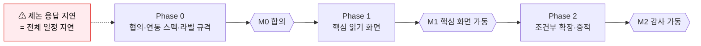
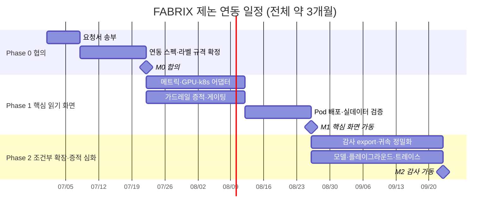

# FABRIX Endpoint — 일정 / WBS (제논 연동 / 수집기 모델)

> **목적**: 제논 수집기 모델 기준 개발 단계·작업분해(WBS)·마일스톤·의존성을 정의한다.
> **작성**: 메이머스트(MAYMUST) · 2026-06-24 (기준일) · 짝 문서 [01-기획서.md](01-기획서.md) · [02-아키텍처.md](02-아키텍처.md)
> **핵심 전제**: **전체 약 3개월(Phase 0 협의 포함)**. 연동 방식 미정이라 **Phase 0(제논 협의·연동 스펙 확정)이 전체 critical path** — 협의 응답 속도가 후속 단계를 좌우한다.

---

## 1. 단계 구분

| 단계 | 목표 | 산출물 | 게이트(완료 조건) |
|---|---|---|---|
| **Phase 0 — 협의·연동 스펙 확정** | 제논 요청서 회신 → 항목별 A/B 경로·권한·노출 형식 확정 | 연동 스펙 합의서, 아키텍처 §3 표 확정 | 요청서 항목(기획서 §9) 가능/불가 판정 + 접근 자격증명 수령 |
| **Phase 1 — 핵심 읽기 화면** | 제논 read 로 보는 메트릭·쿠버·가드레일 결과 + capability 게이팅 | 관제·사용량(총량)·GPU·트래픽·엔드포인트(조회)·가드레일 증적 | 제논 실데이터로 핵심 화면 검증 |
| **Phase 2 — 조건부 확장·증적 심화** | 추가 데이터 read 열릴 때 점진 노출 + 감사 export | 감사 export·귀속 정밀화·모델 조회·플레이그라운드·트레이스 (불변 보존 WORM은 요건 시) | 감사 export 검증 |

> 기존 로드맵(Phase 1+2 ≈ 6개월)에서 **배포·임포트·게이트웨이 강제가 범위 제외**되어 **전체 약 3개월로 단축**된다(Phase 0 협의 포함). 단 **Phase 0 협의 지연**이 신규 임계 변수다.

---

## 2. WBS (작업 분해)

> **전체 약 3개월(Phase 0 협의 포함)**. 주(週)는 상대 기간이며, Phase 0 협의가 지연되면 전체가 그만큼 밀린다.

### Phase 0 — 협의·연동 스펙 확정 (목표 ~3주)
| ID | 작업 | 산출물 | 선행 |
|---|---|---|---|
| P0-1 | 제논에 요청서(기획서 §9) + **점검 체크리스트(기획서 §10)** 전달, 제논이 ☑/☒ 작성 | 작성된 체크리스트 | — |
| P0-2 | 항목별 A/B 경로·권한 협의 + **메트릭 라벨/로그 필드 수집 규격 확정**(아키텍처 §3.1: `model_name`·`pod`·`exported_pod`·귀속 키 등) | 연동 스펙 표 + 라벨 규격 | P0-1 |
| P0-3 | 접근 자격증명·엔드포인트 수령 | 자격증명 | P0-2 |
| P0-4 | 현 클러스터 Pod 배포 입력 수령(네임스페이스·이미지 레지스트리/미러·read RBAC) | 배포 입력 | P0-2 |
| P0-G | **게이트**: §10 체크리스트 전 항목 판정 완료 + 아키텍처 §3 경로 + 배포 입력 확정 | 합의서 | P0-1~4 |

### Phase 1 — 핵심 읽기 화면: 메트릭 · 쿠버 · 가드레일 결과 (목표 ~5주)
> 제논 read 권한으로 보는 기본 화면. capability `metrics`·`k8sRead`·`guardAudit` 로 켜지는 것(기획서 §6).

| ID | 작업 | 산출물 | 선행 |
|---|---|---|---|
| P1-1 | 메트릭 어댑터(A/B 분기) → 관제·트래픽 | 관제·트래픽 화면 | P0-G |
| P1-2 | GPU/DCGM 어댑터 → GPU/MIG 드릴다운 | GPU 화면 | P0-G |
| P1-3 | k8s read 어댑터 → 엔드포인트·Pod 로그(조회) | 엔드포인트 화면 | P0-G |
| P1-4 | 사용량 어댑터(메트릭 기반 **모델 총량**) → 사용량 화면 | 사용량 화면 | P1-1 |
| P1-5 | **가드레일 결과 수집** → 증적 뷰(차단율·필터·상세) | 가드레일 증적 | P0-G |
| P1-6 | **capability manifest + 프론트 게이팅**(`/api/v1/capabilities`, 화면 노출/숨김) | 게이팅 | P0-G |
| P1-7 | FABRIX Pod 인클러스터 배포(web+backend, read RBAC) | 배포 매니페스트 | P0-G |
| P1-G | **게이트**: 제논 실데이터로 핵심 3대 화면(메트릭·쿠버·가드레일) 검증 | 검증 리포트 | P1-1~7 |

### Phase 2 — 추가 데이터 read 열릴 때 조건부 확장 & 증적 심화 (목표 ~4주)
> 제논이 더 많은 데이터를 read 로 열어줄 때 capability `traces`·`inference`·`modelRegistry`·`usageAttribution`·`directory` 가 켜지며 점진 노출.

| ID | 작업 | 산출물 | 선행 플래그 |
|---|---|---|---|
| P2-1 | 감사 export (증적 불변 보존 WORM은 감사 요건 확인 시) | export | `guardAudit` |
| P2-2 | 사용량 귀속 정밀화(앱/부서/키/세션) + Top5·추세 | 귀속 리포트 | `usageAttribution` |
| P2-3 | 모델 조회 화면 | 모델 화면 | `modelRegistry` |
| P2-4 | 플레이그라운드·멀티모델 비교·평가(LLM-as-judge) | 검증 화면 | `inference` |
| P2-5 | 분산 트레이스/세션 | 트레이스·세션 | `traces` |
| P2-6 | 사용자 단위 귀속(사내 디렉터리) / 정책 읽기 미러 / 키 인식 | 귀속·정책·키 | `directory` 등 |
| P2-G | **게이트**: 감사 export 검증 + 확장 화면 점검 (불변 보존은 요건 시) | 감사 리포트 | P2-1~2 |

---

## 3. 마일스톤

| 마일스톤 | 내용 | 의존 |
|---|---|---|
| M0 | 연동 스펙 합의 완료 | P0-G |
| M1 | 관측 화면 실데이터 가동 | P1-G |
| M2 | 거버넌스 증적·감사 가동 | P2-G |

---

## 4. 일정(상대) 요약

**임계경로 — 제논 협의가 모든 것의 선행**

**간트 (착수 = Phase 0 게이트 통과 기준 상대 · 날짜는 예시)**

- **전체 약 3개월(~12주)**: Phase 0 ~3주 + Phase 1 ~5주 + Phase 2 ~4주. Phase 0 협의가 지연되면 그만큼 전체가 뒤로 밀린다.

---

## 5. 의존성 · 리스크

| 리스크 | 영향 | 대응 |
|---|---|---|
| **제논 응답 지연** | Phase 0 게이트 미통과 → 전 단계 정지 | 요청서를 항목별 가능/불가 체크리스트로 구조화, 부분 수령분부터 착수 |
| 가드레일 증적 미노출 | Phase 2 핵심 미사용 | 분류 테스트 도구 데모로 가치 시연 + 노출 협의 지속 |
| 귀속 메타 부재 | 사용자별 추적 불가 | 모델 총량으로 우선 인도, 세션 매핑 후속 |
| 연동 경로 변경 | 어댑터 재작업 | A/B 분기를 어댑터 인터페이스로 추상화(코드 영향 국소화) |

---

## 6. 가정

- **전체 약 3개월(Phase 0 협의 포함)**. Phase 1/2 착수는 Phase 0 게이트 통과(자격증명·스펙 수령) 기준이며, 협의 지연 시 전체가 밀린다.
- 다수 화면 코드는 v0.16 기존 자산 재사용 → 신규는 *어댑터(A/B 분기)·읽기 전용 전환·트래픽 메트릭 재구현* 중심.
- 배포·임포트·게이트웨이 강제는 범위 제외(기획서 §3).

---
*본 일정은 제논 협의 결과에 따라 갱신한다.*
