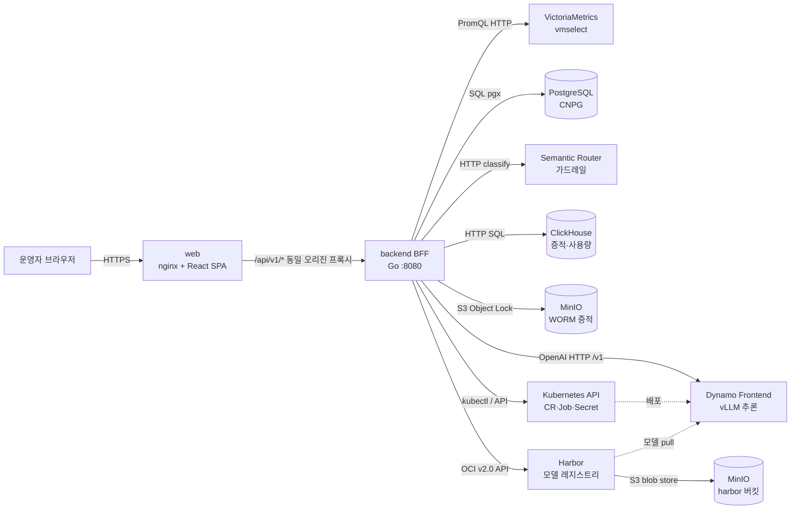
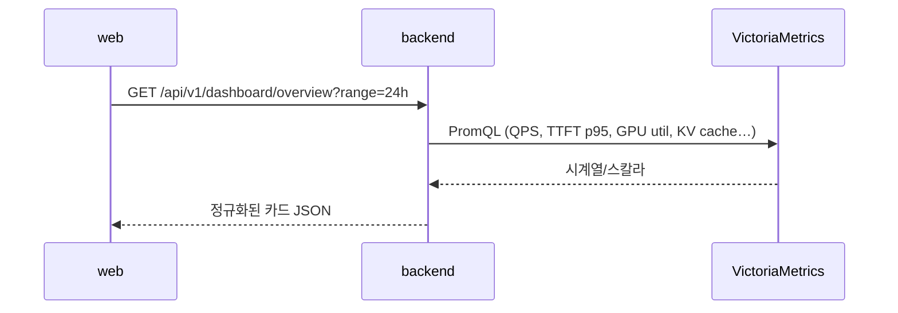
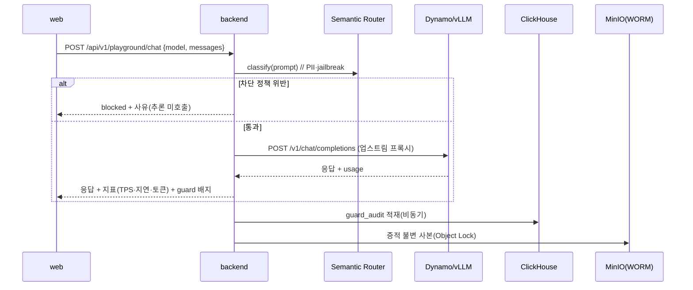
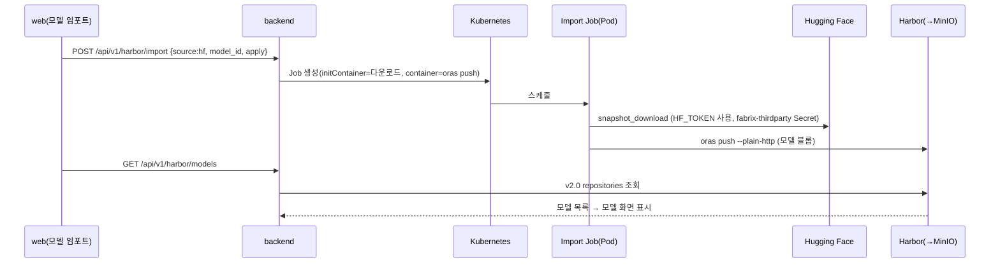
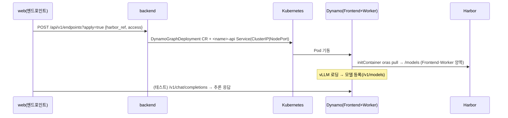
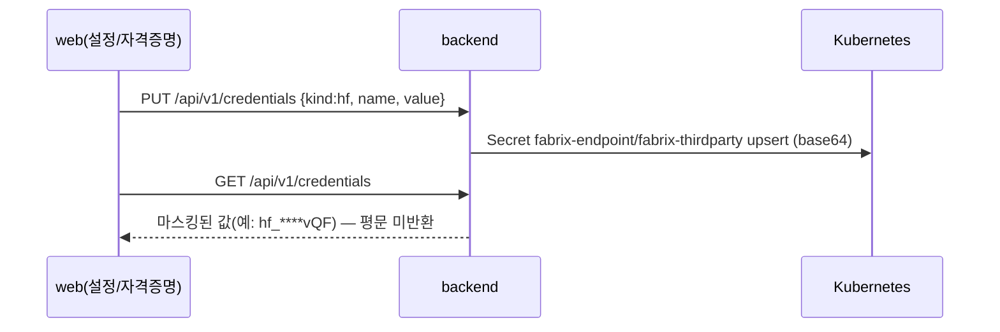

# FABRIX Endpoint — 인프라 · 통신 아키텍처

> 이 프로그램을 돌리기 위해 **무엇이**, **왜**, **어떻게** 통신하는지와 **무엇이 필요한지**를 정리한 문서입니다.
> 기준 코드: `backend/cmd/api/main.go`, `backend/internal/config/config.go`, `scripts/dev-up.sh`, `deploy/k8s/*`. 코드 `v0.16.0`.
> 작성일: 2026-06-19 (Asia/Seoul). 회사: 메이머스트(MAYMUST).
> 짝 문서: [기능-명세.md](기능-명세.md) · [기능-현황-로드맵.md](기능-현황-로드맵.md) · 대외용 [고객제공-Fabrix-소개-제논연동계획.md](고객제공-Fabrix-소개-제논연동계획.md) · [노션-로드맵-DB.md](노션-로드맵-DB.md)
>
> 🔻 **외부 공유 주의**: 본 문서는 내부 노드명(`gpu-worker-*`)·NodePort·네임스페이스·내부 IP 를 포함합니다. 고객·파트너 공유 시 비식별화(§9)와 IR/보안 검토를 권장합니다.

---

## 1. 개요

**FABRIX Endpoint**는 사내 GPU/추론 플랫폼(NVIDIA Dynamo + vLLM)을 위한 **운영·거버넌스 콘솔**입니다.
구조는 단순한 **2-tier + BFF** 입니다.

- **web** — React + Vite 정적 SPA (nginx 서빙). 사용자 화면.
- **backend (BFF)** — Go HTTP API. 화면이 필요로 하는 데이터를 여러 사내 시스템에서 모아 가공해 한 곳으로 제공하고, 모든 추론/거버넌스 트래픽의 **단일 통과 지점** 역할을 합니다.

> BFF(Backend-For-Frontend)인 이유: 대시보드 한 화면을 그리는 데 메트릭(VictoriaMetrics)·증적(ClickHouse)·키(PostgreSQL)·모델 상태(k8s) 등 여러 소스가 필요합니다. 프런트가 직접 모두 호출하면 인증·CORS·집계가 복잡해지므로, 백엔드가 대신 호출·집계·정규화합니다.

---

## 2. 한눈에 보는 아키텍처

핵심 원칙: **모든 외부 의존은 선택적(optional)** 입니다. 특정 시스템이 없거나 죽어도 백엔드는 뜨고, 그 기능만 "비활성/빈 상태"로 우아하게 폴백합니다(§8).

---

## 3. 구성 요소 (배포 단위)

| 단위 | 기술 | 역할 | 컨테이너 | 매니페스트 |
|---|---|---|---|---|
| **web** | React 18 + Vite + TS, nginx | 화면 SPA, `/api`→백엔드 프록시 | `web/Dockerfile` | `deploy/k8s/fabrix-endpoint.yaml` |
| **backend** | Go (net/http, 표준 ServeMux) | BFF API, 통합·집계·거버넌스 통과점 | `backend/Dockerfile` | `deploy/k8s/fabrix-endpoint.yaml` |

백엔드 내부 패키지(역할 = "어떤 외부와 통신하는가"):

| 패키지 | 책임 | 통신 대상 |
|---|---|---|
| `provider/live`,`provider/mock` | 대시보드/사용량/GPU 데이터 | VictoriaMetrics (live) |
| `catalog` | 서빙 모델 카탈로그 + 채팅 프록시 | Dynamo/vLLM `/v1` |
| `guard` | 가드레일 분류 | Semantic Router |
| `audit` (+`audit` WORM) | 증적 적재/조회 + 불변 보존 | ClickHouse, MinIO |
| `usage` | 사용량 롤업 | ClickHouse |
| `store` | 키·앱·사용자·조직 | PostgreSQL |
| `k8s` | 엔드포인트 CR·임포트 Job·자격증명 Secret | Kubernetes API (kubectl) |
| `harbor` | 모델 레지스트리 조회 | Harbor v2.0 API |
| `quota`,`proxystats`,`httpx` | 쿼터·프록시 통계·미들웨어(로깅/CORS) | (내부) |

---

## 4. 외부 의존 시스템 — 무엇을 / 왜 / 어떻게

| # | 시스템 | 프로토콜 | 왜 필요한가 | in-cluster 주소 | dev 접근 |
|---|---|---|---|---|---|
| 1 | **VictoriaMetrics** (vmselect) | HTTP PromQL | 관제/사용량/GPU 화면의 실시간 메트릭(QPS·TTFT·GPU util·KV cache) | `vmselect-vm.observability:8481` | NodePort **30401** |
| 2 | **Dynamo Frontend** (vLLM) | OpenAI HTTP `/v1` | 플레이그라운드·평가의 실제 추론 호출, 모델 상태 프로브 | `*-frontend-nodeport.dynamo-inference:8000`, `*.vllm:8000` | NodePort **30812**(gemma) |
| 3 | **PostgreSQL** (CNPG) | pgx (TCP 5432) | API 키·앱·사용자·부서(조직) 영속화 | `fabrix-pg-rw.fabrix-endpoint:5432` | port-forward **5432** |
| 4 | **Semantic Router** | HTTP | 프롬프트 가드레일 분류(PII·jailbreak·intent) | `semantic-router.vllm-semantic-router-system:8080` | port-forward **18080** |
| 5 | **ClickHouse** | HTTP SQL | 가드레일 증적(`guard_audit`)·사용량 롤업(`usage_rollup`) 적재·조회 | `clickhouse.fabrix-endpoint:8123` | NodePort **30123** |
| 6 | **MinIO** (WORM) | S3 (Object Lock) | 증적 **불변 보존**(규제 대응, 변조 불가) | `minio.minio:9000` | NodePort **30903** |
| 7 | **Harbor** | OCI / REST v2.0 | 모델 **레지스트리**(임포트 저장소, 배포 시 pull 원본) | `harbor-core.harbor`, `core.harbor.*` | NodePort **30834** |
| 8 | **Kubernetes API** | kubectl/client | 엔드포인트(DynamoGraphDeployment CR) 생성·삭제, 임포트 Job, 자격증명 Secret | in-cluster ServiceAccount | `~/.kube/config` |

> **중요 — Harbor 의 실제 블롭 저장소는 MinIO 입니다.** Harbor 레지스트리는 S3 드라이버로 `minio.minio.svc:9000`(버킷 `harbor`)에 모델 블롭을 저장합니다. 즉 모델 임포트 용량은 **MinIO 분산 디스크 가용량**에 종속됩니다(§10 참고).

---

## 5. 주요 통신 흐름 (시퀀스)

### (A) 관제 / 사용량 / GPU 조회

*live 미설정 시 `provider/mock` 으로 폴백 → 화면은 동일하게 뜨되 표본 데이터.*

### (B) 플레이그라운드 추론 (+ 가드레일 + 증적)

*가드레일이 모든 추론 앞단을 통과 = 거버넌스/귀속의 단일 지점.*

### (C) 모델 임포트 (Hugging Face → Harbor)

### (D) 엔드포인트 배포 (Harbor 참조 → Dynamo 서빙 → 추론)

> ⚠ Dynamo 함정(검증됨): **Frontend 도 모델을 `/models` 에 마운트**해야 모델 디스커버리가 로컬 tokenizer/config 를 읽습니다. 안 하면 경로를 HF id 로 오인해 등록 실패(`/v1/models` 빈 목록). 또한 추론 API(8000)는 기본 서비스에 없어 **`<name>-api` 서비스를 별도 생성**합니다. (`backend/internal/k8s/k8s.go`)

### (E) 서드파티 자격증명 저장

---

## 6. 포트 / 엔드포인트 인벤토리

**백엔드 리슨**: `:8080` (`FABRIX_API_ADDR`). 프런트는 동일 오리진 `/api/v1/*` 로 호출(dev 는 Vite 프록시, 운영은 nginx 프록시).

**dev 접근 경로** (`scripts/dev-up.sh`, 노드 IP `192.168.160.43`):

| 대상 | 방식 | 포트 |
|---|---|---|
| VictoriaMetrics vmselect | NodePort | 30401 |
| Dynamo gemma frontend | NodePort | 30812 |
| ClickHouse | NodePort | 30123 |
| MinIO WORM | NodePort | 30903 |
| Harbor | NodePort | 30834 |
| Semantic Router | port-forward (keeper, 20s 자동복구) | 18080→8080 |
| PostgreSQL | port-forward (keeper) | 5432→5432 |

> dev 는 NodePort(항상 통신) + 견고한 port-forward keeper 조합으로, 노트북 슬립/이동 후에도 통신이 끊기지 않게 설계되어 있습니다.

> **v0.16.0 신규 읽기 엔드포인트**(외부 의존 변동 없음 — 기존 VictoriaMetrics·ClickHouse·kubectl 위에서 동작): `GET /gpu/timeseries`(per-GPU 시계열)·`/proxy/pipeline`(엔진 단계 분해)·`/usage/trend`(추세)·`/models/metrics`(모델 운영 메트릭)·`/endpoints/{ns}/{name}/logs`(Pod 로그 tail). 전체 라우트 목록은 [기능-명세.md §4](기능-명세.md) 참고.

---

## 7. 실행에 필요한 것 (전제조건)

### 7.1 빌드/런타임
- **backend**: Go (모듈 `github.com/maymust/fabrix-endpoint`), `kubectl`(PATH 또는 `FABRIX_KUBECTL`)
- **web**: Node + npm (Vite 빌드) / 운영은 nginx 이미지
- **클러스터**: Kubernetes (NVIDIA Dynamo Operator, DCGM, VictoriaMetrics, ClickHouse, CNPG, MinIO, Harbor, Semantic Router 가 사전 설치)

### 7.2 환경변수 (`config.Load`)
| 변수 | 기본값 | 의미 |
|---|---|---|
| `FABRIX_API_ADDR` | `:8080` | 리슨 주소 |
| `FABRIX_ALLOWED_ORIGINS` | `http://localhost:5173` | CORS |
| `FABRIX_DATA_SOURCE` | `mock` | `mock`\|`live` |
| `FABRIX_VMSELECT_URL` | (인클러스터 DNS) | 메트릭 |
| `FABRIX_GEMMA_UPSTREAM` | (인클러스터 DNS) | 추론 업스트림 |
| `FABRIX_DATABASE_URL` | (빈값) | 비면 키/조직 기능 비활성 |
| `FABRIX_SR_URL` | (빈값) | 비면 가드레일 통과 |
| `FABRIX_CLICKHOUSE_URL` | (빈값) | 비면 증적/사용량 비활성 |
| `FABRIX_WORM_URL` / `_BUCKET` / `_RETAIN_DAYS` | (빈값)/`fabrix-worm`/`365` | WORM 보존 |
| `FABRIX_HARBOR_URL` | (빈값) | 비면 모델 레지스트리 비활성 |
| `FABRIX_KUBECTL` / `FABRIX_ENDPOINTS_NS` | `kubectl`/`dynamo-inference` | k8s 조작 |
| `FABRIX_AUDIT_SALT` / `FABRIX_POLICY_VERSION` | dev기본/`v1` | 증적 해시·정책버전 |

> 비밀(DB·Harbor 비밀번호 등)은 `.env.dev.local`(gitignore)로 주입합니다. **이 문서에는 비밀번호를 기재하지 않습니다.**

### 7.3 클러스터 사전 리소스 (`deploy/k8s/`)
`clickhouse.yaml`(+schema), `postgres.yaml`(+schema), `minio.yaml`, `semantic-router-values.yaml`, `dev-nodeports.yaml`, `fabrix-endpoint.yaml`(web+backend), `harbor-registry-*.yaml`, `vmservicescrape-dynamo-frontend.yaml`.

---

## 8. 폴백 / 장애 격리 설계

각 의존은 시작 시 도달성을 확인하고, 실패하면 **해당 기능만** 끄고 나머지는 정상 가동합니다.

| 미설정/장애 시스템 | 영향 | 폴백 동작 |
|---|---|---|
| VictoriaMetrics | 관제/사용량/GPU | `mock` 표본 데이터로 화면 유지 |
| Semantic Router | 가드레일 | **통과(allow)** — 추론은 계속 |
| ClickHouse | 증적/사용량 | 적재·조회 비활성, 화면은 빈 상태 |
| MinIO(WORM) | 증적 불변보존 | 보존만 생략, 증적 적재는 ClickHouse로 계속 |
| PostgreSQL | 키·앱·조직 | 키/조직 기능만 비활성 |
| Harbor | 모델 레지스트리 | 모델 화면 "레지스트리 미구성" |
| kubectl/k8s | 엔드포인트·임포트·자격증명 | 해당 기능 비활성 |

→ "부분 장애에도 콘솔은 뜬다"가 설계 목표입니다.

---

## 9. 보안 노트
- 비밀은 `.env.dev.local`(dev) / k8s Secret(운영, 예: `fabrix-thirdparty`, `harbor-import`)로만 주입. 코드/문서에 평문 미포함.
- 자격증명 조회는 **마스킹 응답**(평문 미반환).
- 엔드포인트 삭제는 **FABRIX 가 생성한 CR(label `fabrix.managed-by`)만** 허용, 보호 네임스페이스는 거부(운영 리소스 보호).
- 증적 `user_ref` 는 솔트 해시로 비식별화.

---

## 10. 알려진 인프라 제약 (2026-06-19 기준)
- **MinIO 분산 용량 종속**: Harbor 블롭이 MinIO(2노드×2드라이브 erasure)에 저장됨. 한 노드(gpu-worker-03)의 `/data`(md0)가 100% 사용 중이라(주로 `/data/CLAM-master` 3T 연구데이터) **대용량 모델(예 gemma 59G) 임포트가 `XMinioStorageFull`로 차단**됨. 소형 모델(qwen 776MB 등)은 정상. → 대용량 임포트 전 gpu-worker-03 공간 확보 필요. (확인 필요: 운영 정리 정책)
- 모델 카탈로그(플레이그라운드/평가용)는 현재 `catalog.go` 에 **코드 등재된 서빙 목록 기반**(gemma·qwen3·qwen2.5-vl·bge-m3·bge-reranker)으로 업스트림 `/v1/models` 상태를 프로브합니다. 모델(레지스트리) 화면은 Harbor 실데이터로 별도 동작합니다.

---
*문의: Claude 운영 담당 황인철(terachul@maymust.com). 본 문서는 코드 기준 작성이며, 인프라 변경 시 갱신이 필요합니다.*
